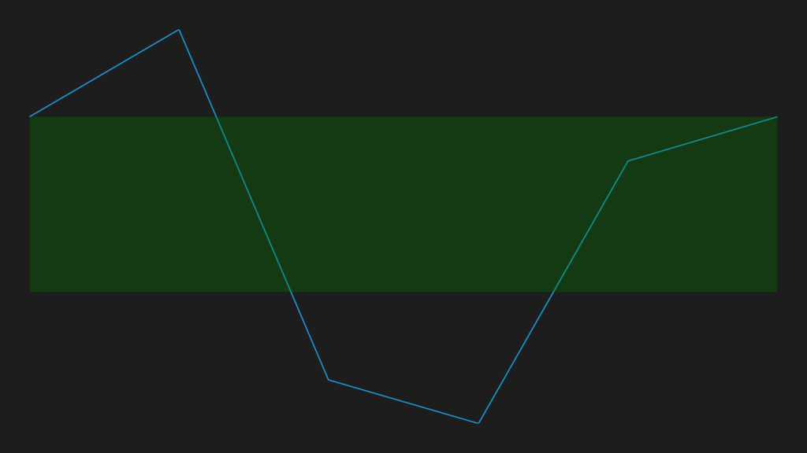

# Range Band in WPF Sparkline (SfSparkline)

The range band feature is used to highlight a particular range along the Y axis.





 <Syncfusion:SfLineSparkline
     ItemsSource="{Binding UsersList}"
     BandRangeStart="2000"
     BandRangeEnd="-1000"
     RangeBandBrush="Green"
     YBindingPath="NoOfUsers">
 </Syncfusion:SfLineSparkline>





SfLineSparkline sparkline = new SfLineSparkline()
{
    ItemsSource = new UsersViewModel().UsersList,
    YBindingPath = "NoOfUsers",
    BandRangeStart = 2000,
    BandRangeEnd = -1000,
    RangeBandBrush = new SolidColorBrush(Colors.Green)
};





The following is a snapshot of the range band.

