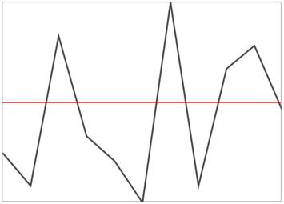
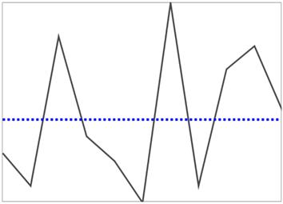

# Show and Hide Axis in WPF Sparkline (SfSparkline)

The following code is used to enable the axis. This feature is applicable for all sparklines except the WinLoss sparkline. You can also style the axis using the `AxisStyle` property and position the axis using the `AxisOrigin` property.





<Syncfusion:SfLineSparkline 
    ShowAxis="True" 
    ItemsSource="{Binding UsersList}" 
    YBindingPath="NoOfUsers">
</Syncfusion:SfLineSparkline>





SfLineSparkline sparkline = new SfLineSparkline()
{
    ItemsSource = new UsersViewModel().UsersList,
    YBindingPath = "NoOfUsers",
    ShowAxis = true
};





The following is a snapshot of the axis visibility.

**Axis origin**





<Syncfusion:SfLineSparkline
    Height="250"
    Width="350"
    Interior="#4a4a4a"
    BorderBrush="DarkGray"
    BorderThickness="1"
    ShowAxis="True"
    AxisOrigin="2"
    ItemsSource="{Binding UsersList}"
    YBindingPath="NoOfUsers">
</Syncfusion:SfLineSparkline>





SfLineSparkline sparkline = new SfLineSparkline()
{
    ItemsSource = new UsersViewModel().UsersList,
    YBindingPath = "NoOfUsers",
    ShowAxis = true,
    AxisOrigin = 2,
    Interior = new SolidColorBrush(Color.FromRgb(0x4a, 0x4a, 0x4a)),
    BorderBrush = new SolidColorBrush(Colors.DarkGray),
    BorderThickness = new Thickness(1)
};





**Axis line style**





<Grid.Resources>
    
</Grid.Resources>

<Syncfusion:SfLineSparkline
        Height="250"
        Width="350"
        Interior="#4a4a4a"
        BorderBrush="DarkGray"
        BorderThickness="1"
        ShowAxis="True"
        AxisStyle="{StaticResource lineStyle2}"
        AxisOrigin="1"
        ItemsSource="{Binding UsersList}"
        YBindingPath="NoOfUsers">
</Syncfusion:SfLineSparkline>





SfLineSparkline sparkline = new SfLineSparkline()
{
    ItemsSource = new UsersViewModel().UsersList,
    YBindingPath = "NoOfUsers",
    ShowAxis = true,
    AxisOrigin = 1,
    AxisStyle = this.Resources["lineStyle2"] as Style,
    Interior = new SolidColorBrush(Color.FromRgb(0x4a, 0x4a, 0x4a)),
    BorderBrush = new SolidColorBrush(Colors.DarkGray),
    BorderThickness = new Thickness(1)
};





