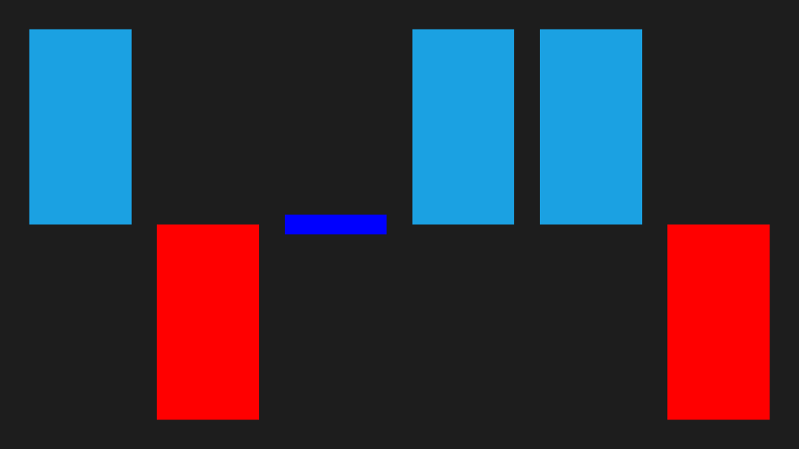

# Sparkline Types in WPF Sparkline (SfSparkline)

## Line sparkline

The line sparkline is rendered using a polyline. The following code is used to create a line sparkline.





<Grid.DataContext>
    <local:UsersViewModel/>
</Grid.DataContext>

<Syncfusion:SfLineSparkline
    ItemsSource="{Binding UsersList}"
    YBindingPath="NoOfUsers">
</Syncfusion:SfLineSparkline>





SfLineSparkline sparkline = new SfLineSparkline()
{
	ItemsSource = new UsersViewModel().UsersList,
	YBindingPath = "NoOfUsers"
};





The following illustrates the result of the above code sample.

## Column sparkline

The column sparkline is used to visualize the raw data as rectangles. The following code is used to create a column sparkline.





<Syncfusion:SfColumnSparkline 
    ItemsSource="{Binding UsersList}" 
    YBindingPath="NoOfUsers">
</Syncfusion:SfColumnSparkline>





SfColumnSparkline sparkline = new SfColumnSparkline()
{
	ItemsSource = new UsersViewModel().UsersList,
	YBindingPath = "NoOfUsers"
};





The following is a snapshot of the column sparkline.

## Area sparkline

The following code is used to create an area sparkline. All line sparkline features are applicable for the area sparkline.





<Syncfusion:SfAreaSparkline 
    ItemsSource="{Binding UsersList}" 
    YBindingPath="NoOfUsers">
</Syncfusion:SfAreaSparkline>





SfAreaSparkline sparkline = new SfAreaSparkline()
{
	ItemsSource = new UsersViewModel().UsersList,
	YBindingPath = "NoOfUsers"
};





The following is a snapshot of the area sparkline.

## WinLoss sparkline

The WinLoss sparkline renders as column segments and shows the positive, negative, and neutral values.





<Page.DataContext>
	<local:MatchDetailsViewModel/>
</Page.DataContext>

<Syncfusion:SfWinLossSparkline 
	x:Name="sparkline" 
	ItemsSource="{Binding Match}" 
	YBindingPath="Result">
</Syncfusion:SfWinLossSparkline>





SfWinLossSparkline sparkline = new SfWinLossSparkline()
{
    ItemsSource = new MatchDetailsViewModel().Match,
    YBindingPath = "Result"
};

public class MatchDetailsModel
{
    public double Result { get; set; }
    public string Status { get; set; }
}

public class MatchDetailsViewModel
{
    public ObservableCollection<MatchDetailsModel> Match { get; set; }

    public MatchDetailsViewModel()
    {
        this.Match = new ObservableCollection<MatchDetailsModel>();

        this.Match.Add(new MatchDetailsModel() { Result = 1, Status = "Win" });
        this.Match.Add(new MatchDetailsModel() { Result = -1, Status = "Loss" });
        this.Match.Add(new MatchDetailsModel() { Result = 0, Status = "Draw" });
        this.Match.Add(new MatchDetailsModel() { Result = 1, Status = "Win" });
        this.Match.Add(new MatchDetailsModel() { Result = 1, Status = "Win" });
        this.Match.Add(new MatchDetailsModel() { Result = -1, Status = "Loss" });
    }
}





Execute the above code to render the following output.

