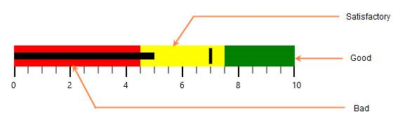
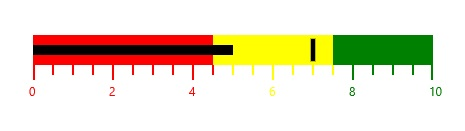

# Ranges in WPF Bullet Graph (SfBulletGraph)

Ranges for a bullet graph are a collection of qualitative ranges. A qualitative range is a visual element that begins at [`RangeStart`](https://help.syncfusion.com/cr/wpf/Syncfusion.UI.Xaml.BulletGraph.QualitativeRange.html#Syncfusion_UI_Xaml_BulletGraph_QualitativeRange_RangeStart) and ends at a specified [`RangeEnd`](https://help.syncfusion.com/cr/wpf/Syncfusion.UI.Xaml.BulletGraph.QualitativeRange.html#Syncfusion_UI_Xaml_BulletGraph_QualitativeRange_RangeEnd), continuing from the previous range's RangeEnd. The qualitative ranges are arranged according to each RangeEnd value.

## Customizing Ranges

The width of the ranges can be customized by setting the [`QualitativeRangesSize`](https://help.syncfusion.com/cr/wpf/Syncfusion.UI.Xaml.BulletGraph.SfBulletGraph.html#Syncfusion_UI_Xaml_BulletGraph_SfBulletGraph_QualitativeRangesSize) property. By changing the [`RangeStroke`](https://help.syncfusion.com/cr/wpf/Syncfusion.UI.Xaml.BulletGraph.QualitativeRange.html#Syncfusion_UI_Xaml_BulletGraph_QualitativeRange_RangeStroke) of the qualitative range, the stroke of the range can be personalized. By setting the [`RangeOpacity`](https://help.syncfusion.com/cr/wpf/Syncfusion.UI.Xaml.BulletGraph.QualitativeRange.html#Syncfusion_UI_Xaml_BulletGraph_QualitativeRange_RangeOpacity) of the qualitative range, the opacity of the range is modified.




        <syncfusion:SfBulletGraph QualitativeRangesSize="30" Minimum="0" Maximum="10" Interval="2"
                                  MinorTicksPerInterval="3" MinorTickSize="8" FeaturedMeasure="5"
                                  ComparativeMeasure="7">
            <syncfusion:SfBulletGraph.QualitativeRanges>
                <syncfusion:QualitativeRange RangeEnd="4.5" 
                                             RangeStroke="Red"
                                             RangeOpacity="1">
                </syncfusion:QualitativeRange>
                <syncfusion:QualitativeRange RangeEnd="7.5" 
                                             RangeStroke="Yellow"
                                             RangeOpacity="1">
                </syncfusion:QualitativeRange>
                <syncfusion:QualitativeRange RangeEnd="10" 
                                             RangeStroke="Green"
                                             RangeOpacity="1">
                </syncfusion:QualitativeRange>
            </syncfusion:SfBulletGraph.QualitativeRanges>
        </syncfusion:SfBulletGraph>





           SfBulletGraph bulletgraph = new SfBulletGraph();
            bulletgraph.Minimum = 0;
            bulletgraph.Maximum = 10;
            bulletgraph.FeaturedMeasure = 5;
            bulletgraph.ComparativeMeasure = 7;
            bulletgraph.Interval = 2;
            bulletgraph.MinorTickSize = 8;
            bulletgraph.MinorTicksPerInterval = 3;
            bulletgraph.QualitativeRangesSize = 30;
            bulletgraph.QualitativeRanges.Add(new QualitativeRange()
            {
                RangeEnd = 4.5,
                RangeOpacity = 1,
                RangeStroke = new SolidColorBrush(Colors.Red)
            });
            bulletgraph.QualitativeRanges.Add(new QualitativeRange()
            {
                RangeEnd = 7.5,
                RangeOpacity = 1,
                RangeStroke = new SolidColorBrush(Colors.Yellow)
            });
            bulletgraph.QualitativeRanges.Add(new QualitativeRange()
            {
                RangeEnd = 10,
                RangeOpacity = 1,
                RangeStroke = new SolidColorBrush(Colors.Green)
            });
            Grid.SetColumn(bulletgraph, 0);
            grid.Children.Add(bulletgraph);




## Binding RangeStroke to Ticks and Labels

By setting the [`BindRangeStrokeToLabels`](https://help.syncfusion.com/cr/wpf/Syncfusion.UI.Xaml.BulletGraph.SfBulletGraph.html#Syncfusion_UI_Xaml_BulletGraph_SfBulletGraph_BindRangeStrokeToLabels) property, the stroke of the labels is set to match the stroke of the specified ranges. Similarly, by setting the [`BindRangeStrokeToTicks`](https://help.syncfusion.com/cr/wpf/Syncfusion.UI.Xaml.BulletGraph.SfBulletGraph.html#Syncfusion_UI_Xaml_BulletGraph_SfBulletGraph_BindRangeStrokeToTicks) property, the stroke of the ticks is set to match the stroke of the specified ranges.




    <syncfusion:SfBulletGraph QualitativeRangesSize="30" Minimum="0" Maximum="10" Interval="2"
    BindRangeStrokeToLabels="True" BindRangeStrokeToTicks="True"
                                  MinorTicksPerInterval="3" MinorTickSize="8" FeaturedMeasure="5"
                                  ComparativeMeasure="7">
            <syncfusion:SfBulletGraph.QualitativeRanges>
                <syncfusion:QualitativeRange RangeEnd="4.5" 
                                             RangeStroke="Red"
                                             RangeOpacity="1">
                </syncfusion:QualitativeRange>
                <syncfusion:QualitativeRange RangeEnd="7.5" 
                                             RangeStroke="Yellow"
                                             RangeOpacity="1">
                </syncfusion:QualitativeRange>
                <syncfusion:QualitativeRange RangeEnd="10" 
                                             RangeStroke="Green"
                                             RangeOpacity="1">
                </syncfusion:QualitativeRange>
            </syncfusion:SfBulletGraph.QualitativeRanges>
        </syncfusion:SfBulletGraph>





            SfBulletGraph bulletgraph = new SfBulletGraph();
            bulletgraph.Minimum = 0;
            bulletgraph.Maximum = 10;
            bulletgraph.FeaturedMeasure = 5;
            bulletgraph.ComparativeMeasure = 7;
            bulletgraph.Interval = 2;
            bulletgraph.MinorTickSize = 8;
            bulletgraph.MinorTicksPerInterval = 3;
            bulletgraph.QualitativeRangesSize = 30;
            bulletgraph.BindRangeStrokeToLabels = true;
            bulletgraph.BindRangeStrokeToTicks = true;
            bulletgraph.QualitativeRanges.Add(new QualitativeRange()
            {
                RangeEnd = 4.5,
                RangeOpacity = 1,
                RangeStroke = new SolidColorBrush(Colors.Red)
            });
            bulletgraph.QualitativeRanges.Add(new QualitativeRange()
            {
                RangeEnd = 7.5,
                RangeOpacity = 1,
                RangeStroke = new SolidColorBrush(Colors.Yellow)
            });
            bulletgraph.QualitativeRanges.Add(new QualitativeRange()
            {
                RangeEnd = 10,
                RangeOpacity = 1,
                RangeStroke = new SolidColorBrush(Colors.Green)
            });
            Grid.SetColumn(bulletgraph, 0);
            grid.Children.Add(bulletgraph);




