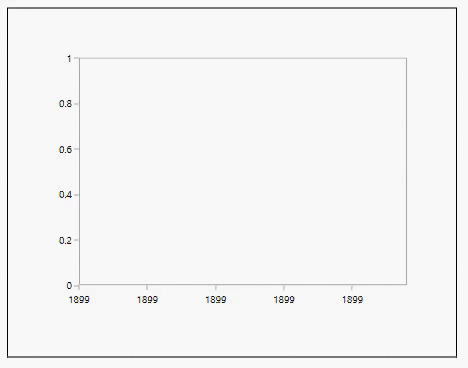
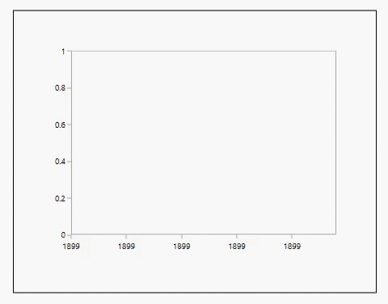
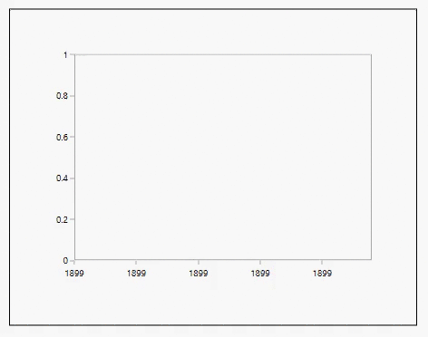

# Animation in WPF Charts (SfChart)

SfChart allows you to animate the chart series on loading and whenever the ItemsSource changes. Animation in a chart can be enabled by setting the EnableAnimation property to `true` and defining the corresponding animation speed with the AnimationDuration property.

The following types of series support Animation.

* Line
* Column
* Bar
* Area
* Scatter
* Bubble
* Spline
* Spline Area
* Stacking Column
* Stacking Bar
* Stacking Area
* Pie

The following APIs are used to customize the Animation.

* [`EnableAnimation`](https://help.syncfusion.com/cr/wpf/Syncfusion.UI.Xaml.Charts.ChartSeriesBase.html#Syncfusion_UI_Xaml_Charts_ChartSeriesBase_EnableAnimation) - Represents a boolean value to enable the animation for series. The default value is `false`.
* [`AnimationDuration`](https://help.syncfusion.com/cr/wpf/Syncfusion.UI.Xaml.Charts.ChartSeriesBase.html#Syncfusion_UI_Xaml_Charts_ChartSeriesBase_AnimationDuration) - Represents a TimeSpan value that sets the animation speed for the series.

The following example shows the Animation feature for chart series.





<syncfusion:SfChart>
    <syncfusion:ColumnSeries 
        EnableAnimation="True" 
        AnimationDuration="00:00:03"
        XBindingPath="Category"
        YBindingPath="Count"
        ItemsSource="{Binding Data}"/>
</syncfusion:SfChart>





ColumnSeries columnSeries = new ColumnSeries()
{
    ItemsSource = new ViewModel().Data,
    XBindingPath = "Category",
    YBindingPath = "Count",
    EnableAnimation = true,
    AnimationDuration = new TimeSpan(00, 00, 03)
};

chart.Series.Add(columnSeries);





**Column Series**

**Spline Area Series**

**Scatter Series**

N> Set the [`EnableAnimation`](https://help.syncfusion.com/cr/wpf/Syncfusion.UI.Xaml.Charts.ChartSeriesBase.html#Syncfusion_UI_Xaml_Charts_ChartSeriesBase_EnableAnimation) property to `true` to play the animation on loading the chart and whenever the [`ItemsSource`](https://help.syncfusion.com/cr/wpf/Syncfusion.UI.Xaml.Charts.ChartSeriesBase.html#Syncfusion_UI_Xaml_Charts_ChartSeriesBase_ItemsSource) is changed.

N> If the [`AnimationDuration`](https://help.syncfusion.com/cr/wpf/Syncfusion.UI.Xaml.Charts.ChartSeriesBase.html#Syncfusion_UI_Xaml_Charts_ChartSeriesBase_AnimationDuration) is set to `00:00:00` (zero), the animation will not be visible. Set a valid TimeSpan value for the animation to be played.

N> You can refer to our [WPF Charts](https://www.syncfusion.com/wpf-controls/charts) feature tour page for its groundbreaking feature representations. You can also explore our [WPF Charts example](https://github.com/syncfusion/wpf-demos/tree/master/chart/Views) to know various chart types and how to easily configure them with built-in support for creating stunning visual effects.