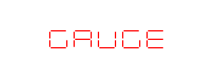
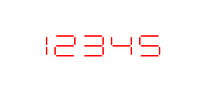
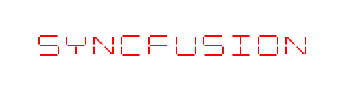
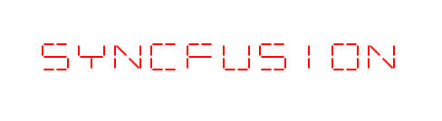
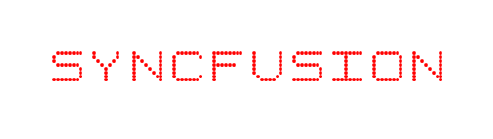

# Digital Characters in WPF Digital Gauge (SfDigitalGauge)

The digital characters in the digital gauge can be viewed in different types of segments. These digital characters are set to the digital gauge through the [`Value`](https://help.syncfusion.com/cr/wpf/Syncfusion.UI.Xaml.Gauges.SfDigitalGauge.html#Syncfusion_UI_Xaml_Gauges_SfDigitalGauge_Value) property of type string. The type of segment used to display the characters is determined by the [`CharacterType`](https://help.syncfusion.com/cr/wpf/Syncfusion.UI.Xaml.Gauges.SfDigitalGauge.html#Syncfusion_UI_Xaml_Gauges_SfDigitalGauge_CharacterType) property.




    <syncfusion:SfDigitalGauge Value="GAUGE" />    





    SfDigitalGauge digitalgauge = new SfDigitalGauge();
    digitalgauge.Value = "GAUGE";
    this.Grid.Children.Add(digitalgauge);




## 7-Segments

By default, the digital characters set as the [`Value`](https://help.syncfusion.com/cr/wpf/Syncfusion.UI.Xaml.Gauges.SfDigitalGauge.html#Syncfusion_UI_Xaml_Gauges_SfDigitalGauge_Value) property are displayed using 7-segments. These are mainly used to display numbers rather than letters. The type of segments can be set by the [`CharacterType`](https://help.syncfusion.com/cr/wpf/Syncfusion.UI.Xaml.Gauges.SfDigitalGauge.html#Syncfusion_UI_Xaml_Gauges_SfDigitalGauge_CharacterType) property.




    <syncfusion:SfDigitalGauge Value="12345"  CharacterType="SegmentSeven" />





    SfDigitalGauge digitalgauge = new SfDigitalGauge();
    digitalgauge.Value = "12345";
    digitalgauge.CharacterType = CharacterType.SegmentSeven;
    this.Grid.Children.Add(digitalgauge);




## 14-Segments

The digital characters set as the [`Value`](https://help.syncfusion.com/cr/wpf/Syncfusion.UI.Xaml.Gauges.SfDigitalGauge.html#Syncfusion_UI_Xaml_Gauges_SfDigitalGauge_Value) property can be displayed using 14 segments. This type of character is used to display both alphabets and numbers. Set the [`CharacterType`](https://help.syncfusion.com/cr/wpf/Syncfusion.UI.Xaml.Gauges.SfDigitalGauge.html#Syncfusion_UI_Xaml_Gauges_SfDigitalGauge_CharacterType) property to `SegmentFourteen` to display characters in this format.




    <syncfusion:SfDigitalGauge Value="SYNCFUSION" CharacterType="SegmentFourteen" />





    SfDigitalGauge digitalgauge = new SfDigitalGauge();
    digitalgauge.Value = "SYNCFUSION";
    digitalgauge.CharacterType = CharacterType.SegmentFourteen;
    this.Grid.Children.Add(digitalgauge);




## 16-Segments

The digital characters set as the [`Value`](https://help.syncfusion.com/cr/wpf/Syncfusion.UI.Xaml.Gauges.SfDigitalGauge.html#Syncfusion_UI_Xaml_Gauges_SfDigitalGauge_Value) property can be displayed using 16 segments. Like 14-segment characters, this type is also used to display both alphabets and numbers, with finer segment detail. Set the [`CharacterType`](https://help.syncfusion.com/cr/wpf/Syncfusion.UI.Xaml.Gauges.SfDigitalGauge.html#Syncfusion_UI_Xaml_Gauges_SfDigitalGauge_CharacterType) property to `SegmentSixteen` to display characters in this format.




    <syncfusion:SfDigitalGauge Value="SYNCFUSION" CharacterType="SegmentSixteen" />





    SfDigitalGauge digitalgauge = new SfDigitalGauge();
    digitalgauge.Value = "SYNCFUSION";
    digitalgauge.CharacterType = CharacterType.SegmentSixteen;
    this.Grid.Children.Add(digitalgauge);




## 8×8 Dot Matrix Segments

The digital characters set as the [`Value`](https://help.syncfusion.com/cr/wpf/Syncfusion.UI.Xaml.Gauges.SfDigitalGauge.html#Syncfusion_UI_Xaml_Gauges_SfDigitalGauge_Value) property can be displayed using 8×8 dot matrix segments. This type of character is used to display special characters along with alphabets and numbers. Set the [`CharacterType`](https://help.syncfusion.com/cr/wpf/Syncfusion.UI.Xaml.Gauges.SfDigitalGauge.html#Syncfusion_UI_Xaml_Gauges_SfDigitalGauge_CharacterType) property to `EightCrossEightDotMatrix` to display characters in this format.




    <syncfusion:SfDigitalGauge Value="SYNCFUSION" CharacterType="EightCrossEightDotMatrix" />





    SfDigitalGauge digitalgauge = new SfDigitalGauge();
    digitalgauge.Value = "SYNCFUSION";
    digitalgauge.CharacterType = CharacterType.EightCrossEightDotMatrix;
    this.Grid.Children.Add(digitalgauge);




