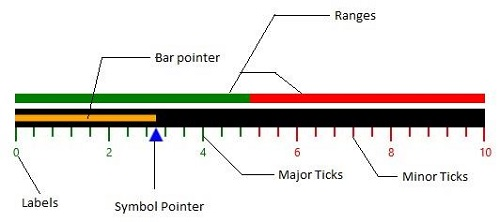

# WPF LinearGauge (SfLinearGauge) Overview

The [`LinearGauge`](https://help.syncfusion.com/cr/wpf/Syncfusion.Windows.Gauge.LinearGauge.html) displays a range of values graphically along the linear scale, which is considered as the linear form of the linear gauge. It measures the values of the scale and presents them in horizontal sliding, vertical sliding, or meter form.

The [`LinearGauge`](https://help.syncfusion.com/cr/wpf/Syncfusion.Windows.Gauge.LinearGauge.html) control is used to visualize numerical values of a scale in a linear manner. By using the [`LinearGauge`](https://help.syncfusion.com/cr/wpf/Syncfusion.Windows.Gauge.LinearGauge.html) control, you can render a thermometer.

## Key features

### Scale

The [`Scale`](https://help.syncfusion.com/wpf/linear-gauge/scale) supports adding a scale to the linear gauge using horizontal and vertical orientations.

### Ranges

Highlights the desired [`Ranges`](https://help.syncfusion.com/wpf/linear-gauge/ranges) of values in the gauge scale.

### Pointers

The [`Pointers`](https://help.syncfusion.com/wpf/linear-gauge/pointers) support adding multiple pointers (bar and symbol) to the linear scale.

