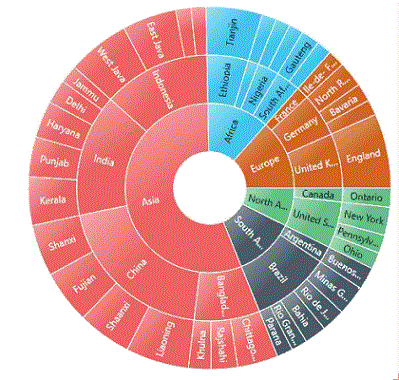
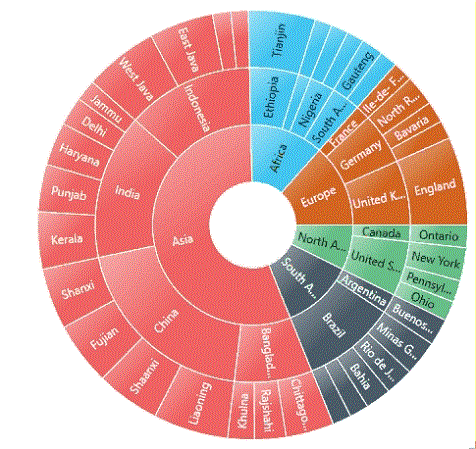

---

layout: post
title: Animation in WPF Sunburst Chart control | Syncfusion
description: Learn here all about Animation support in Syncfusion WPF Sunburst Chart (SfSunburstChart) control and more.
platform: chart-sdk
control: SfSunburstChart 
documentation: ug

---

# Animation in WPF Sunburst Chart (SfSunburstChart)

The Sunburst Chart allows you to animate the chart segments. You can enable animation using the [`EnableAnimation`](https://help.syncfusion.com/cr/wpf/Syncfusion.UI.Xaml.SunburstChart.SfSunburstChart.html#Syncfusion_UI_Xaml_SunburstChart_SfSunburstChart_EnableAnimation) property. You can also set the duration for animation by using the [`AnimationDuration`](https://help.syncfusion.com/cr/wpf/Syncfusion.UI.Xaml.SunburstChart.SfSunburstChart.html#Syncfusion_UI_Xaml_SunburstChart_SfSunburstChart_AnimationDuration) property.





<sunburst:SfSunburstChart 
    EnableAnimation="True" 
    AnimationDuration="5000">
</sunburst:SfSunburstChart>





sunburstChart.EnableAnimation = true;
sunburstChart.AnimationDuration = 5000;





## Animation Types

The Sunburst Chart provides options to animate the chart segments in different ways using the [`AnimationType`](https://help.syncfusion.com/cr/wpf/Syncfusion.UI.Xaml.SunburstChart.SfSunburstChart.html#Syncfusion_UI_Xaml_SunburstChart_SfSunburstChart_AnimationType) property.

FadeIn – It gradually changes the opacity of the chart segment.

Rotation – During an animation, the control rotates from 0 to 360 degrees.

### FadeIn

The following example shows how to enable the FadeIn animation:





<sunburst:SfSunburstChart 
    EnableAnimation="True"
    AnimationType="FadeIn">
</sunburst:SfSunburstChart>





sunburstChart.EnableAnimation = true;
sunburstChart.AnimationType = AnimationType.FadeIn;





### Rotation

The following example shows how to enable the Rotation animation:





<sunburst:SfSunburstChart 
    EnableAnimation="True"
    AnimationType="Rotation">
</sunburst:SfSunburstChart>





sunburstChart.EnableAnimation = true;
sunburstChart.AnimationType = AnimationType.Rotation;





