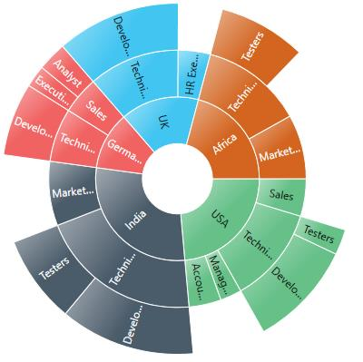
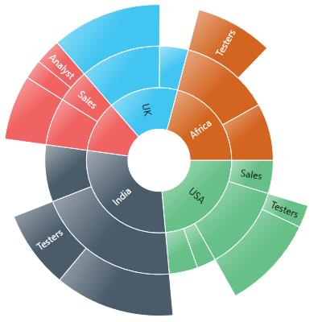
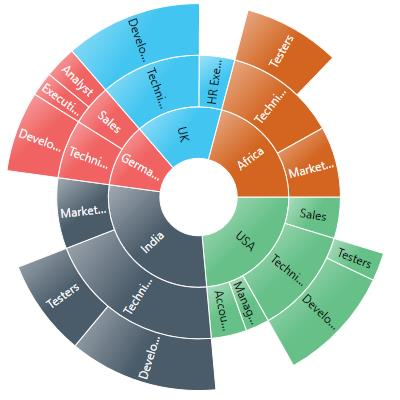
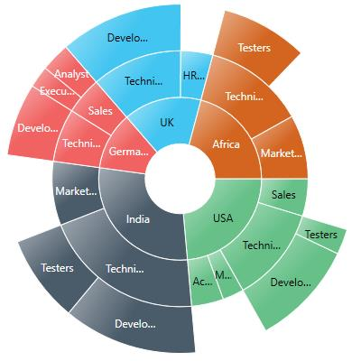
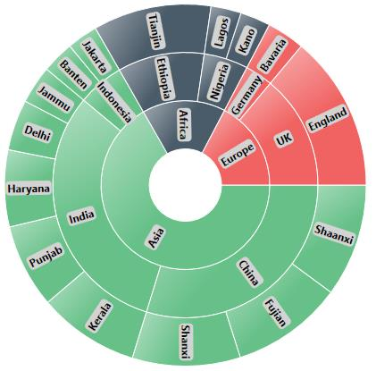

---

layout: post
title: Data Label in WPF Sunburst Chart control | Syncfusion
description: Learn here all about Data Label support in Syncfusion WPF Sunburst Chart (SfSunburstChart) control and more.
platform: charts-sdk
control: SfSunburstChart 
documentation: ug

---

# Data Label in WPF Sunburst Chart (SfSunburstChart)

Sunburst data labels are used to display the data related to the segment. They help to provide information about the data points to the users.

You can enable or disable the data labels by using the [`ShowLabel`](https://help.syncfusion.com/cr/wpf/Syncfusion.UI.Xaml.SunburstChart.SunburstDataLabelInfo.html#Syncfusion_UI_Xaml_SunburstChart_SunburstDataLabelInfo_ShowLabel) property as shown in the below code:





<sunburst:SfSunburstChart.DataLabelInfo>
    <sunburst:SunburstDataLabelInfo ShowLabel="True"/>
</sunburst:SfSunburstChart.DataLabelInfo>





SunburstDataLabelInfo dataLabelInfo = new SunburstDataLabelInfo()
{
    ShowLabel = true
};

chart.DataLabelInfo = dataLabelInfo;





N> By default, the ShowLabel property value is True.

## LabelOverflowMode

When you represent huge data with data labels, they may intersect each other. You can avoid this using the [`LabelOverflowMode`](https://help.syncfusion.com/cr/wpf/Syncfusion.UI.Xaml.SunburstChart.SunburstDataLabelInfo.html#Syncfusion_UI_Xaml_SunburstChart_SunburstDataLabelInfo_LabelOverflowMode) property.

The following modes are used to avoid the overlapping:

* Trim – To trim the large data labels.
* Hide – To hide the overlapped data labels.

The following code shows how to set Hide and Trim modes:

### Hide





<sunburst:SfSunburstChart.DataLabelInfo>
    <sunburst:SunburstDataLabelInfo ShowLabel="True" LabelOverflowMode="Hide"/>
</sunburst:SfSunburstChart.DataLabelInfo>





SunburstDataLabelInfo dataLabelInfo = new SunburstDataLabelInfo()
{
    ShowLabel = true,
    LabelOverflowMode = LabelOverflowMode.Hide
};

chart.DataLabelInfo = dataLabelInfo;





### Trim





<sunburst:SfSunburstChart.DataLabelInfo>
    <sunburst:SunburstDataLabelInfo ShowLabel="True" LabelOverflowMode="Trim"/>
</sunburst:SfSunburstChart.DataLabelInfo>





SunburstDataLabelInfo dataLabelInfo = new SunburstDataLabelInfo()
{
    ShowLabel = true,
    LabelOverflowMode = LabelOverflowMode.Trim
};

chart.DataLabelInfo = dataLabelInfo;





## LabelRotationMode

You can rotate the data label by using the [`LabelRotationMode`](https://help.syncfusion.com/cr/wpf/Syncfusion.UI.Xaml.SunburstChart.SunburstDataLabelInfo.html#Syncfusion_UI_Xaml_SunburstChart_SunburstDataLabelInfo_LabelRotationMode) property.

The following code shows how to set [`LabelRotationMode`](https://help.syncfusion.com/cr/wpf/Syncfusion.UI.Xaml.SunburstChart.LabelRotationMode.html) as Normal and Angle:





<sunburst:SfSunburstChart.DataLabelInfo>
    <sunburst:SunburstDataLabelInfo ShowLabel="True" LabelRotationMode="Normal"/>
</sunburst:SfSunburstChart.DataLabelInfo>





SunburstDataLabelInfo dataLabelInfo = new SunburstDataLabelInfo()
{
    ShowLabel = true,
    LabelRotationMode = LabelRotationMode.Normal
};

chart.DataLabelInfo = dataLabelInfo;





N> By default, LabelRotationMode value is Angle.

## Font Customization

Data label fonts can be customized using the [`FontFamily`](https://help.syncfusion.com/cr/wpf/Syncfusion.UI.Xaml.SunburstChart.SunburstDataLabelInfo.html#Syncfusion_UI_Xaml_SunburstChart_SunburstDataLabelInfo_FontFamily), [`FontSize`](https://help.syncfusion.com/cr/wpf/Syncfusion.UI.Xaml.SunburstChart.SunburstDataLabelInfo.html#Syncfusion_UI_Xaml_SunburstChart_SunburstDataLabelInfo_FontSize), [`FontStyle`](https://help.syncfusion.com/cr/wpf/Syncfusion.UI.Xaml.SunburstChart.SunburstDataLabelInfo.html#Syncfusion_UI_Xaml_SunburstChart_SunburstDataLabelInfo_FontStyle), and [`FontWeight`](https://help.syncfusion.com/cr/wpf/Syncfusion.UI.Xaml.SunburstChart.SunburstDataLabelInfo.html#Syncfusion_UI_Xaml_SunburstChart_SunburstDataLabelInfo_FontWeight) properties.

The font color of the label can be customized using the [`Foreground`](https://help.syncfusion.com/cr/wpf/Syncfusion.UI.Xaml.SunburstChart.SunburstDataLabelInfo.html#Syncfusion_UI_Xaml_SunburstChart_SunburstDataLabelInfo_Foreground) property.





<sunburst:SfSunburstChart ItemsSource="{Binding Data}" ValueMemberPath="EmployeesCount">
    <sunburst:SfSunburstChart.Levels>
        <sunburst:SunburstHierarchicalLevel GroupMemberPath="Country"/>
        <sunburst:SunburstHierarchicalLevel GroupMemberPath="JobDescription"/>
        <sunburst:SunburstHierarchicalLevel GroupMemberPath="JobGroup"/>
        <sunburst:SunburstHierarchicalLevel GroupMemberPath="JobRole"/>
    </sunburst:SfSunburstChart.Levels>

    <sunburst:SfSunburstChart.DataLabelInfo>
        <sunburst:SunburstDataLabelInfo 
            ShowLabel="True" 
            FontSize="12" 
            FontFamily="Comic Sans MS"                                                
            FontStyle="Italic" 
            FontWeight="SemiBold"                                               
            Foreground="White"/>
    </sunburst:SfSunburstChart.DataLabelInfo>
</sunburst:SfSunburstChart>





SfSunburstChart sunburst = new SfSunburstChart();
sunburst.SetBinding(SfSunburstChart.ItemsSourceProperty, "Data");
sunburst.ValueMemberPath = "EmployeesCount";

sunburst.Levels.Add(new SunburstHierarchicalLevel()
{
    GroupMemberPath = "Country"
});

sunburst.Levels.Add(new SunburstHierarchicalLevel()
{
    GroupMemberPath = "JobDescription"
});

sunburst.Levels.Add(new SunburstHierarchicalLevel()
{
    GroupMemberPath = "JobGroup"
});

sunburst.Levels.Add(new SunburstHierarchicalLevel()
{
    GroupMemberPath = "JobRole"
});

SunburstDataLabelInfo info = new SunburstDataLabelInfo();
info.FontSize = 12;
info.FontStyle = FontStyles.Italic;
info.FontWeight = FontWeights.SemiBold;
info.Foreground = new SolidColorBrush(Colors.White);
info.FontFamily = new FontFamily("Comic Sans MS");

sunburst.DataLabelInfo = info;
grid.Children.Add(sunburst);





## Customizing the Data Labels

You can customize the default appearance or display information about the data point using the [`LabelTemplate`](https://help.syncfusion.com/cr/wpf/Syncfusion.UI.Xaml.SunburstChart.SunburstDataLabelInfo.html#Syncfusion_UI_Xaml_SunburstChart_SunburstDataLabelInfo_LabelTemplate) property:



<sunburst:SunburstDataLabelInfo.LabelTemplate>
    <DataTemplate>
        <Border Background="LightGray" CornerRadius="4">
            <TextBlock 
                Text="{Binding Category}" 
                Margin="2,0,2,0"                                 
                FontWeight="Bold"/>
        </Border>
    </DataTemplate>
</sunburst:SunburstDataLabelInfo.LabelTemplate>



