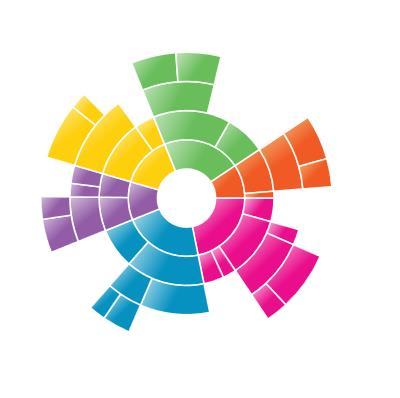
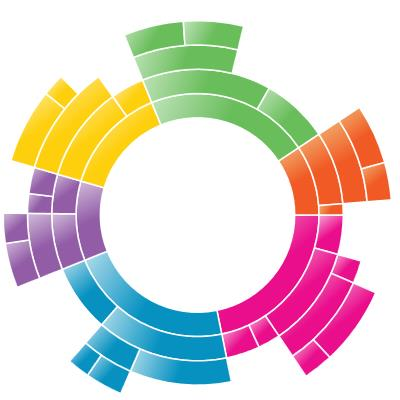

---

layout: post
title: Region in WPF Sunburst Chart control | Syncfusion
description: Learn here all about Region support in Syncfusion WPF Sunburst Chart (SfSunburstChart) control and more.
platform: chart-sdk
control: SfSunburstChart 
documentation: ug

---

# Region in WPF Sunburst Chart (SfSunburstChart)

The Sunburst region represents the entire chart and all its elements. It includes all the chart elements like Legend, DataLabel, Levels, etc. It has some major properties as:

[`ItemsSource`](https://help.syncfusion.com/cr/wpf/Syncfusion.UI.Xaml.SunburstChart.SfSunburstChart.html#Syncfusion_UI_Xaml_SunburstChart_SfSunburstChart_ItemsSource) – Gets or sets the IEnumerable values used to generate the chart.

[`ValueMemberPath`](https://help.syncfusion.com/cr/wpf/Syncfusion.UI.Xaml.SunburstChart.SfSunburstChart.html#Syncfusion_UI_Xaml_SunburstChart_SfSunburstChart_ValueMemberPath) – Gets or sets the property path of the value.

[`Legend`](https://help.syncfusion.com/cr/wpf/Syncfusion.UI.Xaml.SunburstChart.SfSunburstChart.html#Syncfusion_UI_Xaml_SunburstChart_SfSunburstChart_Legend) – Gets or sets the legend for the chart.

[`Levels`](https://help.syncfusion.com/cr/wpf/Syncfusion.UI.Xaml.SunburstChart.SfSunburstChart.html#Syncfusion_UI_Xaml_SunburstChart_SfSunburstChart_Levels) – Gets or sets the collection of hierarchical levels for the chart.

[`DataLabels`](https://help.syncfusion.com/cr/wpf/Syncfusion.UI.Xaml.SunburstChart.SfSunburstChart.html#Syncfusion_UI_Xaml_SunburstChart_SfSunburstChart_DataLabels) – Gets or sets the collection of DataLabels for the chart.

[`Behaviors`](https://help.syncfusion.com/cr/wpf/Syncfusion.UI.Xaml.SunburstChart.SfSunburstChart.html#Syncfusion_UI_Xaml_SunburstChart_SfSunburstChart_Behaviors) – Gets or sets the collection of behaviors for the chart.

## Start and End Angle

You can change the start and end angle of the Sunburst Chart using the [`StartAngle`](https://help.syncfusion.com/cr/wpf/Syncfusion.UI.Xaml.SunburstChart.SfSunburstChart.html#Syncfusion_UI_Xaml_SunburstChart_SfSunburstChart_StartAngle) and [`EndAngle`](https://help.syncfusion.com/cr/wpf/Syncfusion.UI.Xaml.SunburstChart.SfSunburstChart.html#Syncfusion_UI_Xaml_SunburstChart_SfSunburstChart_EndAngle) properties as shown in the below code:





<sunburst:SfSunburstChart StartAngle="180" EndAngle="360"></sunburst:SfSunburstChart>





sunburstChart.StartAngle = 180;
sunburstChart.EndAngle = 360;





## Sunburst Radius

The Sunburst Chart allows you to customize the sunburst radius by using the [`Radius`](https://help.syncfusion.com/cr/wpf/Syncfusion.UI.Xaml.SunburstChart.SfSunburstChart.html#Syncfusion_UI_Xaml_SunburstChart_SfSunburstChart_Radius) property. The default value of this property is 0.9 and the value ranges between 0 to 1.





<sunburst:SfSunburstChart Radius="0.6"></sunburst:SfSunburstChart>





chart.Radius = 0.6;





## Sunburst Inner Radius

The Sunburst Chart allows you to customize the inner radius using the [`InnerRadius`](https://help.syncfusion.com/cr/wpf/Syncfusion.UI.Xaml.SunburstChart.SfSunburstChart.html#Syncfusion_UI_Xaml_SunburstChart_SfSunburstChart_InnerRadius) property. The default value of this property is 0.2 and the value ranges between 0 to 1.





<sunburst:SfSunburstChart InnerRadius="0.5"></sunburst:SfSunburstChart>





chart.InnerRadius = 0.5;





