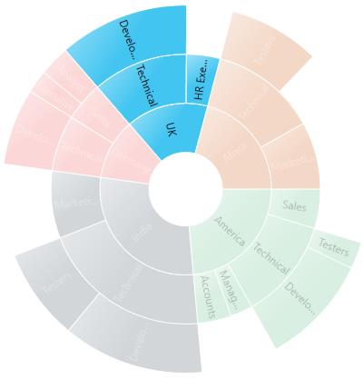
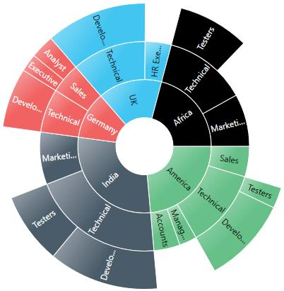
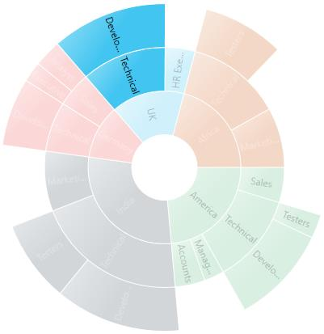
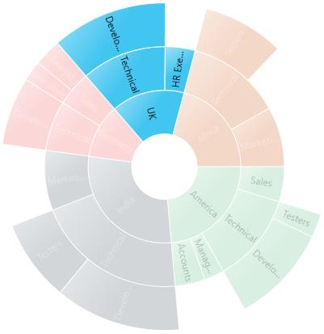
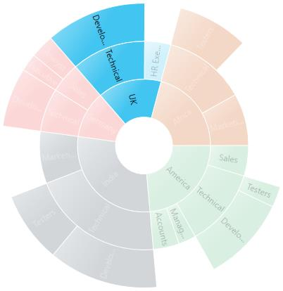
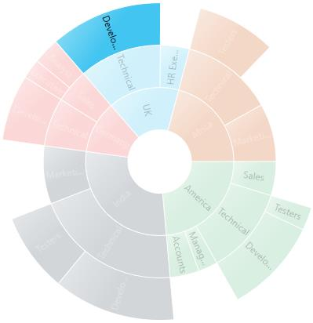
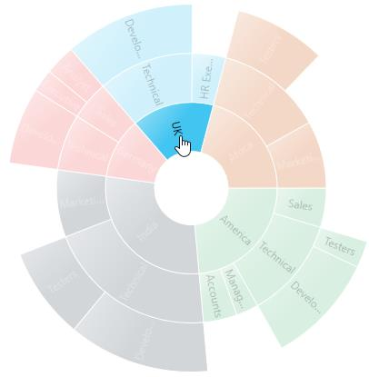

---

layout: post
title: Selection in WPF Sunburst Chart control | Syncfusion
description: Learn here all about Selection support in Syncfusion WPF Sunburst Chart (SfSunburstChart) control and more.
platform: charts-sdk
control: SfSunburstChart 
documentation: ug

---

# Selection in WPF Sunburst Chart (SfSunburstChart)

The Sunburst Chart supports selection that enables you to select a segment by using the [`SunburstSelectionBehavior`](https://help.syncfusion.com/cr/wpf/Syncfusion.UI.Xaml.SunburstChart.SunburstSelectionBehavior.html).

The below code shows how to enable the selection behavior:





<sunburst:SfSunburstChart.Behaviors>
    <sunburst:SunburstSelectionBehavior/>
</sunburst:SfSunburstChart.Behaviors>





SunburstSelectionBehavior selection = new SunburstSelectionBehavior();

chart.Behaviors.Add(selection);





## SelectionDisplayMode

You can customize the selected segment appearance by using a brush or opacity. You can choose between color or opacity using the [`SelectionDisplayMode`](https://help.syncfusion.com/cr/wpf/Syncfusion.UI.Xaml.SunburstChart.SunburstSelectionBehavior.html#Syncfusion_UI_Xaml_SunburstChart_SunburstSelectionBehavior_SelectionDisplayMode) property in the selection behavior:

* HighlightByColor – To display the selected segment appearance using a brush.
* HighlightByOpacity – To display the selected segment appearance using opacity.

The following code shows how to set the display mode using a brush:





<sunburst:SfSunburstChart.Behaviors>
    <sunburst:SunburstSelectionBehavior 
        EnableSelection="True"                    
        SelectionBrush="Black"                    
        SelectionDisplayMode="HighlightByColor">
    </sunburst:SunburstSelectionBehavior>
</sunburst:SfSunburstChart.Behaviors>





SunburstSelectionBehavior selection = new SunburstSelectionBehavior();
selection.EnableSelection = true;
selection.SelectionBrush = new SolidColorBrush(Colors.Black);
selection.SelectionDisplayMode = SelectionDisplayMode.HighlightByColor;

chart.Behaviors.Add(selection);





N> The default value of SelectionDisplayMode is HighlightByOpacity.

## SelectionMode

The Sunburst Chart provides support to select or highlight the segment by clicking or hovering the mouse over a segment. By default, this property value is MouseClick.

* Both – Select the segment using mouse move and mouse click.
* MouseClick – Select the segment using mouse click.
* MouseMove – Select the segment using mouse move.





 <sunburst:SfSunburstChart.Behaviors>
     <sunburst:SunburstSelectionBehavior EnableSelection="True" SelectionMode="MouseClick"/>
 </sunburst:SfSunburstChart.Behaviors>





SunburstSelectionBehavior selection = new SunburstSelectionBehavior();
selection.EnableSelection = true;
selection.SelectionMode = Syncfusion.UI.Xaml.SunburstChart.SelectionMode.MouseClick;

chart.Behaviors.Add(selection);





## SelectionType

The Sunburst Chart provides multiple options to represent the selected categories. You can select the segment categories by using the [`SelectionType`](https://help.syncfusion.com/cr/wpf/Syncfusion.UI.Xaml.SunburstChart.SunburstSelectionBehavior.html#Syncfusion_UI_Xaml_SunburstChart_SunburstSelectionBehavior_SelectionType) property in the selection behavior.

* Child – To select the child of the selected parent.
* Group – To select the entire categories in the group.
* Parent – To select the parent of the selected child.
* Single - To select a single item in the category.

### Child

The following code shows how to set the selection type as Child:





<sunburst:SfSunburstChart.Behaviors>
    <sunburst:SunburstSelectionBehavior EnableSelection="True" SelectionType="Child"/>
</sunburst:SfSunburstChart.Behaviors>





SunburstSelectionBehavior selection = new SunburstSelectionBehavior();
selection.EnableSelection = true;
selection.SelectionType = SelectionType.Child;

chart.Behaviors.Add(selection);





### Group

The following code shows how to set the selection type as Group:





<sunburst:SfSunburstChart.Behaviors>
    <sunburst:SunburstSelectionBehavior EnableSelection="True" SelectionType="Group"/>
</sunburst:SfSunburstChart.Behaviors>





SunburstSelectionBehavior selection = new SunburstSelectionBehavior();
selection.EnableSelection = true;
selection.SelectionType = SelectionType.Group;

chart.Behaviors.Add(selection);





### Parent

The following code shows how to set the selection type as Parent:





<sunburst:SfSunburstChart.Behaviors>
    <sunburst:SunburstSelectionBehavior EnableSelection="True" SelectionType="Parent"/>
</sunburst:SfSunburstChart.Behaviors>





SunburstSelectionBehavior selection = new SunburstSelectionBehavior();
selection.EnableSelection = true;
selection.SelectionType = SelectionType.Parent;

chart.Behaviors.Add(selection);





### Single

The following code shows how to set the selection type as Single:





<sunburst:SfSunburstChart.Behaviors>
    <sunburst:SunburstSelectionBehavior EnableSelection="True" SelectionType="Single"/>
</sunburst:SfSunburstChart.Behaviors>





SunburstSelectionBehavior selection = new SunburstSelectionBehavior();
selection.EnableSelection = true;
selection.SelectionType = SelectionType.Single;

chart.Behaviors.Add(selection);





## Selection Cursor

The SelectionCursor property allows you to customize the cursor when the mouse is hovered over the segment.

The following code shows how to set the selection cursor as Hand:





<sunburst:SfSunburstChart.Behaviors>
    <sunburst:SunburstSelectionBehavior EnableSelection="True" SelectionCursor="Hand"/>
</sunburst:SfSunburstChart.Behaviors>





SunburstSelectionBehavior selection = new SunburstSelectionBehavior();
selection.EnableSelection = true;
selection.SelectionCursor = Cursors.Hand;

chart.Behaviors.Add(selection);





