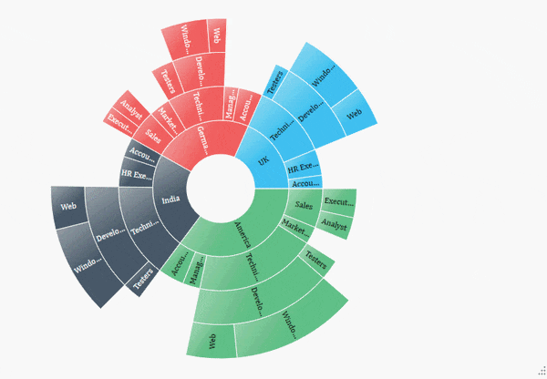
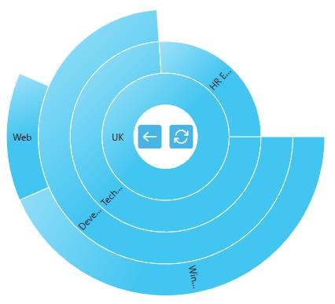

---

layout: post
title: Zooming in WPF Sunburst Chart control | Syncfusion
description: Learn here all about Zooming support in Syncfusion WPF Sunburst Chart (SfSunburstChart) control and more.
platform: charts-sdk
control: SfSunburstChart 
documentation: ug

---

# Zooming in WPF Sunburst Chart (SfSunburstChart)

The Sunburst Chart provides zooming (drill down) experience with animation for both mouse and touch enabled devices. It allows you to virtualize large sets of data into a minimum data view.

The following code shows how to initialize the zooming behavior:





<sunburst:SfSunburstChart.Behaviors>
    <sunburst:SunburstZoomingBehavior/>
</sunburst:SfSunburstChart.Behaviors>





SunburstZoomingBehavior zoom = new SunburstZoomingBehavior();

chart.Behaviors.Add(zoom);





N> You can enable or disable the zooming by using the [`EnableZooming`](https://help.syncfusion.com/cr/wpf/Syncfusion.UI.Xaml.SunburstChart.SunburstZoomingBehavior.html#Syncfusion_UI_Xaml_SunburstChart_SunburstZoomingBehavior_EnableZooming) property. By default, the EnableZooming property value is True.

## Zooming Toolbar

By default, the zooming toolbar will be enabled while zooming the segment; it contains both back and reset options.

You can align the zooming toolbar position by using the [`ToolBarHorizontalAlignment`](https://help.syncfusion.com/cr/wpf/Syncfusion.UI.Xaml.SunburstChart.SunburstZoomingBehavior.html#Syncfusion_UI_Xaml_SunburstChart_SunburstZoomingBehavior_ToolBarHorizontalAlignment) and [`ToolBarVerticalAlignment`](https://help.syncfusion.com/cr/wpf/Syncfusion.UI.Xaml.SunburstChart.SunburstZoomingBehavior.html#Syncfusion_UI_Xaml_SunburstChart_SunburstZoomingBehavior_ToolBarVerticalAlignment) properties.



<sunburst:SfSunburstChart.Behaviors>
    <sunburst:SunburstZoomingBehavior 
        EnableZooming="True"
        ToolBarHorizontalAlignment="Center"
        ToolBarVerticalAlignment="Center">
    </sunburst:SunburstZoomingBehavior>
</sunburst:SfSunburstChart.Behaviors>



You can customize the zooming toolbar using the following properties:

* [`ToolBarItemHeight`](https://help.syncfusion.com/cr/wpf/Syncfusion.UI.Xaml.SunburstChart.SunburstZoomingBehavior.html#Syncfusion_UI_Xaml_SunburstChart_SunburstZoomingBehavior_ToolBarItemHeight) – Gets or sets the height for the toolbar item.
* [`ToolBarItemWidth`](https://help.syncfusion.com/cr/wpf/Syncfusion.UI.Xaml.SunburstChart.SunburstZoomingBehavior.html#Syncfusion_UI_Xaml_SunburstChart_SunburstZoomingBehavior_ToolBarItemWidth) – Gets or sets the width for the toolbar item.
* [`ToolBarItemMargin`](https://help.syncfusion.com/cr/wpf/Syncfusion.UI.Xaml.SunburstChart.SunburstZoomingBehavior.html#Syncfusion_UI_Xaml_SunburstChart_SunburstZoomingBehavior_ToolBarItemMargin) – Gets or sets the margin of the toolbar item.



<sunburst:SfSunburstChart.Behaviors>
    <sunburst:SunburstZoomingBehavior 
        EnableZooming="True"
        ToolBarHorizontalAlignment="Center"
        ToolBarVerticalAlignment="Center"
        ToolBarItemHeight="30"
        ToolBarItemWidth="50"
        ToolBarItemMargin="5"/>
</sunburst:SfSunburstChart.Behaviors>



The toolbar position can also be moved using the [`ToolbarOffsetX`](https://help.syncfusion.com/cr/wpf/Syncfusion.UI.Xaml.SunburstChart.SunburstZoomingBehavior.html#Syncfusion_UI_Xaml_SunburstChart_SunburstZoomingBehavior_ToolbarOffsetX) and [`ToolbarOffsetY`](https://help.syncfusion.com/cr/wpf/Syncfusion.UI.Xaml.SunburstChart.SunburstZoomingBehavior.html#Syncfusion_UI_Xaml_SunburstChart_SunburstZoomingBehavior_ToolbarOffsetY) properties. The offset values range from 0 to 1 from left to right for the x position and top to bottom for the y position.



<sunburst:SfSunburstChart.Behaviors>
    <sunburst:SunburstZoomingBehavior 
        EnableZooming="True" 
        ToolbarOffsetX="0.1" 
        ToolbarOffsetY="0.5"/>
</sunburst:SfSunburstChart.Behaviors>



