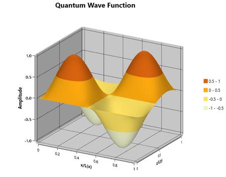

# WPF Surface Chart (SfSurfaceChart) Overview

The Essential Surface Chart shows a three-dimensional surface that connects a set of data points.  

## Key Features of Surface Chart

* Color bar represents a range of values.
* Built-in palettes.
* Supports gradient brushes.
* Perspective and orthographic view.
* Contour and wireframe support.
