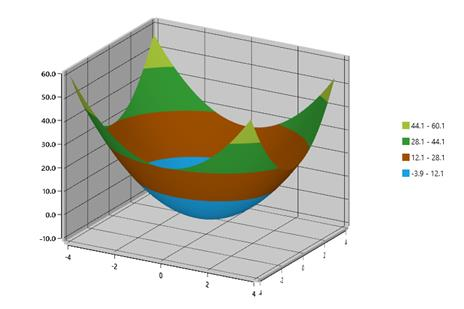
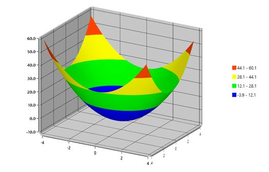

# Palettes in WPF Surface Chart (SfSurfaceChart)

[WPF Surface Chart](https://www.syncfusion.com/wpf-controls/surface-chart) provides options to apply different kinds of palettes.

The predefined palettes include the following:

* Metro
* AutumnBrights
* FloraHues
* Pineapple
* TomotoSpectrum
* RedChrome
* PurpleChrome
* BlueChrome
* GreenChrome
* Elite
* LightCandy
* SandyBeach

### Applying predefined brushes

Using the above palettes, you can apply a set of predefined brushes to the surface chart as shown in the following code example. 





    <chart:SfSurfaceChart Palette="Metro">
    </chart:SfSurfaceChart>
	




SfSurfaceChart chart = new SfSurfaceChart();
chart.Palette = ChartColorPalette.Metro;
grid.Children.Add(chart);





### Applying custom brushes

The custom palette option enables you to define your own color brushes for the Palette using the ColorModel property, as shown in the following code example.





    <chart:SfSurfaceChart Palette="Custom">

        <chart:SfSurfaceChart.ColorModel>

            <chart:ChartColorModel>

                <chart:ChartColorModel.CustomBrushes>

                    <SolidColorBrush Color="Blue"/>

                    <SolidColorBrush Color="Lime"/>

                    <SolidColorBrush Color="Yellow"/>

                    <SolidColorBrush Color="Blue"/>

                    <SolidColorBrush Color="Lime"/>

                    <SolidColorBrush Color="Yellow"/>

                    <SolidColorBrush Color="OrangeRed"/>

                </chart:ChartColorModel.CustomBrushes>

            </chart:ChartColorModel>

        </chart:SfSurfaceChart.ColorModel>

    </chart:SfSurfaceChart>
	




SfSurfaceChart chart = new SfSurfaceChart();

chart.Palette = ChartColorPalette.Custom;

ChartColorModel colorModel = new ChartColorModel();

colorModel.CustomBrushes.Add(new SolidColorBrush(Colors.Blue));

colorModel.CustomBrushes.Add(new SolidColorBrush(Colors.Lime));

colorModel.CustomBrushes.Add(new SolidColorBrush(Colors.Yellow));

colorModel.CustomBrushes.Add(new SolidColorBrush(Colors.Blue));

colorModel.CustomBrushes.Add(new SolidColorBrush(Colors.Lime));

colorModel.CustomBrushes.Add(new SolidColorBrush(Colors.Yellow));

colorModel.CustomBrushes.Add(new SolidColorBrush(Colors.OrangeRed));

chart.ColorModel = colorModel;

grid.Children.Add(chart);





