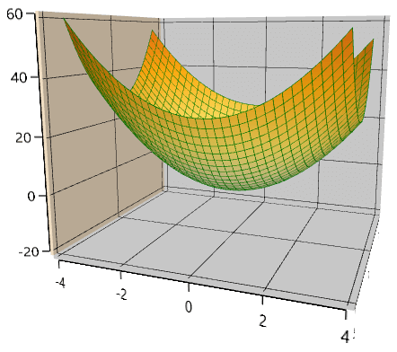

# User interaction in WPF Surface Chart (SfSurfaceChart)

The Essential Surface Chart allows you to zoom and rotate the chart for better visualization of all the axes and their points.

## Zooming

Zooming of the surface chart is controlled with the [`EnableZooming`](https://help.syncfusion.com/cr/wpf/Syncfusion.UI.Xaml.Charts.SfSurfaceChart.html#Syncfusion_UI_Xaml_Charts_SfSurfaceChart_EnableZooming) property.

The following code shows how to enable zooming on the surface chart.





    <chart:SfSurfaceChart EnableZooming="True" >
    </chart:SfSurfaceChart>





SfSurfaceChart chart = new SfSurfaceChart();
chart.EnableZooming = true;
grid.Children.Add(chart);





Zooming can either be done with pinch zooming or programmatically using the [`ZoomLevel`](https://help.syncfusion.com/cr/wpf/Syncfusion.UI.Xaml.Charts.SfSurfaceChart.html#Syncfusion_UI_Xaml_Charts_SfSurfaceChart_ZoomLevel) property.





    <chart:SfSurfaceChart EnableZooming="True" ZoomLevel="0.5">
    </chart:SfSurfaceChart>





SfSurfaceChart chart = new SfSurfaceChart();
chart.EnableZooming = true;
chart.ZoomLevel = 0.5;
grid.Children.Add(chart);





## Rotation

The surface chart can be rotated for better visualization of all the axes and their plots.

This can be controlled using the [`EnableRotation`](https://help.syncfusion.com/cr/wpf/Syncfusion.UI.Xaml.Charts.SurfaceBase.html#Syncfusion_UI_Xaml_Charts_SurfaceBase_EnableRotation) property.





    <chart:SfSurfaceChart EnableRotation="True">
    </chart:SfSurfaceChart>





SfSurfaceChart chart = new SfSurfaceChart();
chart.EnableRotation = true;
grid.Children.Add(chart);





Rotation can either be done with interaction or programmatically using the [`Rotate`](https://help.syncfusion.com/cr/wpf/Syncfusion.UI.Xaml.Charts.SurfaceBase.html#Syncfusion_UI_Xaml_Charts_SurfaceBase_Rotate) property.





    <chart:SfSurfaceChart EnableRotation="True" Rotate="50">
    </chart:SfSurfaceChart>





SfSurfaceChart chart = new SfSurfaceChart();
chart.EnableRotation = true;
chart.Rotate = 50;
grid.Children.Add(chart);





## Tilt

The surface chart can be tilted to a certain angle using the [`Tilt`](https://help.syncfusion.com/cr/wpf/Syncfusion.UI.Xaml.Charts.SurfaceBase.html#Syncfusion_UI_Xaml_Charts_SurfaceBase_Tilt) property.





    <chart:SfSurfaceChart  Tilt="40">
    </chart:SfSurfaceChart>





SfSurfaceChart chart = new SfSurfaceChart();
chart.Tilt = 40;
grid.Children.Add(chart);





