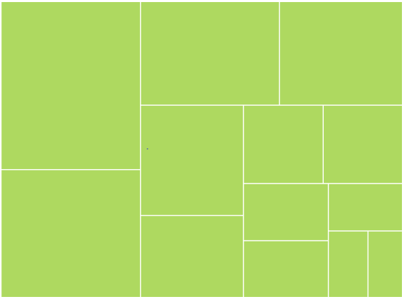

# WeightValuePath in WPF TreeMap (SfTreeMap)

The WeightValuePath ofSfTreeMap is a path to a field on the source object, which serve as the "weight" of the object. 



    <Grid Background="Black">

        <Grid.DataContext>

            <local:PopulationViewModel/>

        </Grid.DataContext>

        <syncfusion:SfTreeMap ItemsSource="{Binding PopulationDetails}" 

                              WeightValuePath="Population”/>

    </Grid>



N> The specified field must be available in each and every sub class (object) defined in hierarchical (nested) data collection.

