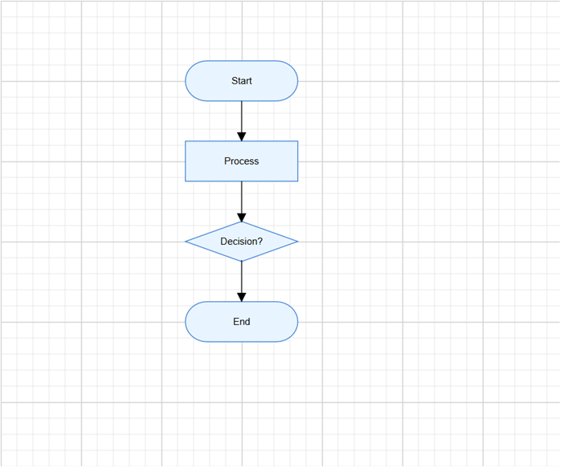

# Getting Started with the ASP.NET Core Diagram Control

This section briefly explains how to include the [ASP.NET Core Diagram](https://www.syncfusion.com/diagram-sdk/aspnet-core-diagram) control in your ASP.NET Web App using [Visual Studio](https://visualstudio.microsoft.com/vs/) and [Visual Studio Code](https://code.visualstudio.com/).

> **Ready to streamline your ASP.NET Core development?** Discover the full potential of ASP.NET Core controls with AI Coding Assistant. Effortlessly integrate, configure, and enhance your projects with intelligent, context-aware code suggestions, streamlined setups, and real-time insights—all seamlessly integrated into your preferred AI-powered IDEs like Visual Studio, Visual Studio Code, Cursor, CodeStudio and more. [Explore AI Coding Assistant](https://ej2.syncfusion.com/aspnetcore/documentation/ai-coding-assistant/overview)

## Create an ASP.NET Core Web App with Razor Pages





Create an **ASP.NET Core Web App** using Visual Studio via [Microsoft Templates](https://learn.microsoft.com/en-us/aspnet/core/tutorials/razor-pages/razor-pages-start?view=aspnetcore-10.0&tabs=visual-studio#create-a-razor-pages-web-app) or the [ASP.NET Core Extension](https://ej2.syncfusion.com/aspnetcore/documentation/visual-studio-integration/create-project).





Run the following command to create a new ASP.NET Core Web App.




dotnet new webapp -o MyDiagramApp
code -r MyDiagramApp




Alternatively, create an ASP.NET Core Web App using Visual Studio Code via [Microsoft Templates](https://learn.microsoft.com/en-us/aspnet/core/tutorials/razor-pages/razor-pages-start?view=aspnetcore-10.0&tabs=visual-studio-code#create-a-razor-pages-web-app) or the [ASP.NET Core Extension](https://ej2.syncfusion.com/aspnetcore/documentation/visual-studio-code-integration/create-project), or the [C# Dev Kit](https://marketplace.visualstudio.com/items?itemName=ms-dotnettools.csdevkit) extension.





## Install the required ASP.NET Core packages

Install the [Syncfusion.AspNetCore.Diagram](https://www.nuget.org/packages/Syncfusion.AspNetCore.Diagram) and [Syncfusion.AspNetCore.Themes](https://www.nuget.org/packages/Syncfusion.AspNetCore.Themes) NuGet packages. All Syncfusion ASP.NET Core packages are available on [nuget.org](https://www.nuget.org/packages?q=Syncfusion.EJ2). See the [NuGet packages](https://ej2.syncfusion.com/aspnetcore/documentation/nuget-packages) topic for details.





1. Go to *Tools → NuGet Package Manager → Manage NuGet Packages for Solution*.
2. Search the required NuGet packages (`Syncfusion.AspNetCore.Diagram` and `Syncfusion.AspNetCore.Themes`) and install them.

Alternatively, you can install the same packages using the Package Manager Console with the following commands.




Install-Package Syncfusion.AspNetCore.Diagram -Version {{ site.releaseversion }}
Install-Package Syncfusion.AspNetCore.Themes -Version {{ site.releaseversion }}








Open the terminal and run the following commands.




dotnet add package Syncfusion.AspNetCore.Diagram --version {{ site.releaseversion }}
dotnet add package Syncfusion.AspNetCore.Themes --version {{ site.releaseversion }}








## Add ASP.NET Core tag helpers

After the packages are installed, open the **~/Pages/_ViewImports.cshtml** file and import the `Syncfusion.AspNetCore.Diagram` and `Syncfusion.AspNetCore.Base` tag helpers.




@addTagHelper *, Syncfusion.AspNetCore.Diagram
@addTagHelper *, Syncfusion.AspNetCore.Base




## Add stylesheet and script references

The theme stylesheet and script can be referenced from NuGet through [Static Web Assets](https://ej2.syncfusion.com/aspnetcore/documentation/appearance/theme#static-web-assets). Include the [stylesheet](https://ej2.syncfusion.com/aspnetcore/documentation/appearance/theme) and [script references](https://ej2.syncfusion.com/aspnetcore/documentation/common/adding-script-references) inside the `<head>` of **~/Pages/Shared/_Layout.cshtml** file.




<head>
    ...
    <link rel="stylesheet" href="_content/Syncfusion.AspNetCore.Themes/styles/fluent2.css" />
    
</head>




## Register the script manager

Open the **~/Pages/Shared/_Layout.cshtml** file and register the script manager (`<ejs-scripts>`) at the end of the `<body>` element as shown below.




<body>
    ...
    <!-- Syncfusion ASP.NET Core Script Manager -->
    <ejs-scripts></ejs-scripts>
</body>




## Add the ASP.NET Core Diagram control

Add the [ASP.NET Core Diagram](https://www.syncfusion.com/diagram-sdk/aspnet-core-diagram) control in the **~/Pages/Index.cshtml** file.




@page
@model IndexModel

<ejs-diagram id="diagram" width="100%" height="580px"></ejs-diagram>




N> The Diagram control must have a valid height. If the height is not set, the Diagram canvas may not be visible.

## Step 7: Create your first Diagram with nodes and connectors

This section explains how to create a simple flowchart by adding nodes, customizing their appearance, and connecting them using connectors.

The following example creates a flowchart with four nodes: **Start**, **Process**, **Decision**, and **End**. Nodes and connectors are defined in `Index.cshtml.cs` as public properties on the page model and accessed in the view via `@Model`. The view then binds them to the `<ejs-diagram>` tag helper.

### Define nodes and connectors

Open **~/Pages/Index.cshtml.cs** and declare `nodes` and `connectors` as public properties on the page model. Populate them inside the `OnGet` method so they are available to the view when the page loads.




using Microsoft.AspNetCore.Mvc.RazorPages;
using Syncfusion.EJ2.Diagrams;
using System.Collections.Generic;

public class IndexModel : PageModel
{
    public List<DiagramNode> nodes { get; set; }
    public List<DiagramConnector> connectors { get; set; }

    public void OnGet()
    {
        // Define nodes
        nodes = new List<DiagramNode>()
        {
            new DiagramNode()
            {
                Id = "node1", OffsetX = 300, OffsetY = 100,
                Shape = new { type = "Flow", shape = "Terminator" },
                Annotations = new List<DiagramNodeAnnotation>()
                {
                    new DiagramNodeAnnotation() { Content = "Start" }
                }
            },
            new DiagramNode()
            {
                Id = "node2", OffsetX = 300, OffsetY = 200,
                Shape = new { type = "Flow", shape = "Process" },
                Annotations = new List<DiagramNodeAnnotation>()
                {
                    new DiagramNodeAnnotation() { Content = "Process" }
                }
            },
            new DiagramNode()
            {
                Id = "node3", OffsetX = 300, OffsetY = 300,
                Shape = new { type = "Flow", shape = "Decision" },
                Annotations = new List<DiagramNodeAnnotation>()
                {
                    new DiagramNodeAnnotation() { Content = "Decision?" }
                }
            },
            new DiagramNode()
            {
                Id = "node4", OffsetX = 300, OffsetY = 400,
                Shape = new { type = "Flow", shape = "Terminator" },
                Annotations = new List<DiagramNodeAnnotation>()
                {
                    new DiagramNodeAnnotation() { Content = "End" }
                }
            }
        };

        // Define connectors
        connectors = new List<DiagramConnector>()
        {
            new DiagramConnector() { Id = "connector1", SourceID = "node1", TargetID = "node2" },
            new DiagramConnector() { Id = "connector2", SourceID = "node2", TargetID = "node3" },
            new DiagramConnector() { Id = "connector3", SourceID = "node3", TargetID = "node4" }
        };
    }
}




### Bind the data

To render the diagram using data from the model, bind **@Model.nodes** and **@Model.connectors** to the `<ejs-diagram>` tag helper. When specifying JavaScript callback functions such as **getNodeDefaults** and **getConnectorDefaults**, pass the function names as string variables from the Razor `@{ }` block.




@page
@model IndexModel
@{
    var getNodeDefaults = "getNodeDefaults";
    var getConnectorDefaults = "getConnectorDefaults";
}
<ejs-diagram id="diagram" width="100%" height="580px"
             nodes="@Model.nodes"
             connectors="@Model.connectors"
             getNodeDefaults="getNodeDefaults"
             getConnectorDefaults="getConnectorDefaults">
</ejs-diagram>




In this example:

* `nodes` and `connectors` are public properties on `IndexModel`, populated in `OnGet()` and accessed in the view via `@Model`.
* [`OffsetX`](https://help.syncfusion.com/cr/aspnetcore-js2/Syncfusion.EJ2.Diagrams.DiagramNode.html#Syncfusion_EJ2_Diagrams_DiagramNode_OffsetX) and [`OffsetY`](https://help.syncfusion.com/cr/aspnetcore-js2/Syncfusion.EJ2.Diagrams.DiagramNode.html#Syncfusion_EJ2_Diagrams_DiagramNode_OffsetY) define the position of each node.
* [`Shape`](https://help.syncfusion.com/cr/aspnetcore-js2/Syncfusion.EJ2.Diagrams.DiagramNode.html#Syncfusion_EJ2_Diagrams_DiagramNode_Shape) sets the flowchart shape type, such as `Terminator`, `Process`, or `Decision`.
* [`Annotations`](https://help.syncfusion.com/cr/aspnetcore-js2/Syncfusion.EJ2.Diagrams.DiagramNode.html#Syncfusion_EJ2_Diagrams_DiagramNode_Annotations) adds a text label inside each node using the [`Content`](https://help.syncfusion.com/cr/aspnetcore-js2/Syncfusion.EJ2.Diagrams.DiagramNodeAnnotation.html#Syncfusion_EJ2_Diagrams_DiagramNodeAnnotation_Content) property.
* [`SourceID`](https://help.syncfusion.com/cr/aspnetcore-js2/Syncfusion.EJ2.Diagrams.DiagramConnector.html#Syncfusion_EJ2_Diagrams_DiagramConnector_SourceID) and [`TargetID`](https://help.syncfusion.com/cr/aspnetcore-js2/Syncfusion.EJ2.Diagrams.DiagramConnector.html#Syncfusion_EJ2_Diagrams_DiagramConnector_TargetID) connect one node to another.
* [`getNodeDefaults`](https://help.syncfusion.com/cr/aspnetcore-js2/Syncfusion.EJ2.Diagrams.Diagram.html#Syncfusion_EJ2_Diagrams_Diagram_GetNodeDefaults) applies common width, height, fill color, and stroke color to all nodes.
* [`getConnectorDefaults`](https://help.syncfusion.com/cr/aspnetcore-js2/Syncfusion.EJ2.Diagrams.Diagram.html#Syncfusion_EJ2_Diagrams_Diagram_GetConnectorDefaults) applies common connector settings such as orthogonal routing and target arrows.

## Run the application





Press <kbd>Ctrl</kbd>+<kbd>F5</kbd> (Windows) or <kbd>⌘</kbd>+<kbd>F5</kbd> (macOS) to launch the application. The [ASP.NET Core Diagram](https://www.syncfusion.com/diagram-sdk/aspnet-core-diagram) control will render in your default web browser.





Open the terminal and run the following command.




dotnet run








N> [View Sample in GitHub](https://github.com/SyncfusionExamples/ASP-NET-Core-Getting-Started-Examples/tree/main/Diagram/ASP.NET%20Core%20Tag%20Helper%20Examples).

## See also

* [Nodes](https://help.syncfusion.com/diagram-sdk/asp-net-core/nodes)
* [Connectors](https://help.syncfusion.com/diagram-sdk/asp-net-core/connectors)
* [Annotations](https://help.syncfusion.com/diagram-sdk/asp-net-core/labels)