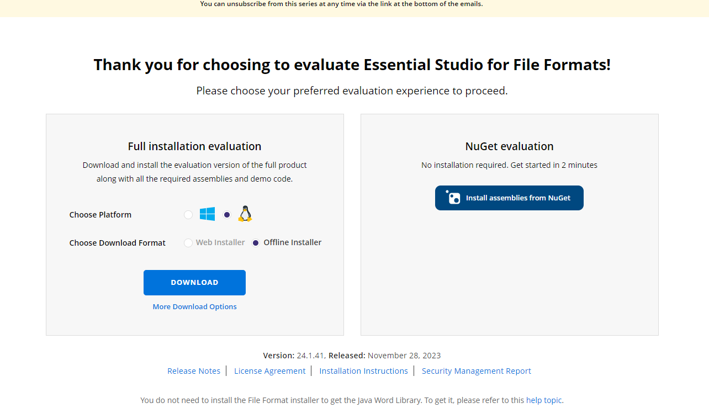
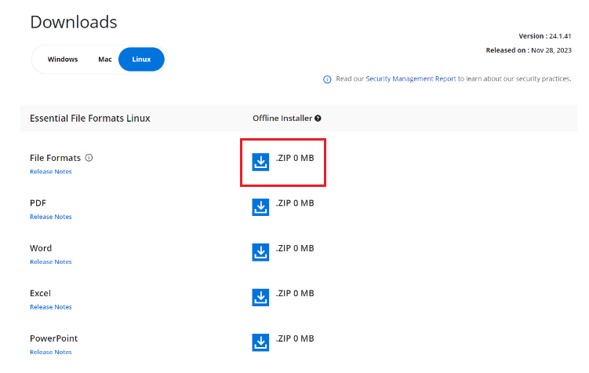

# Download Syncfusion Diagram SDK Linux Installer

The Syncfusion Diagram SDK Linux installer can be downloaded from the [Syncfusion](https://www.syncfusion.com/) website. You can either download the licensed installer or try our trial installer depending on your license.

- Trial Installer
- Licensed Installer

You can download the Syncfusion installer from [Syncfusion.com](https://www.syncfusion.com/) website 

## Download the Trial Version

Our 30-day trial can be downloaded in two ways.

* Download Free Trial Setup
* Start Trials if using components through [NuGet.org](https://www.nuget.org/packages?q=syncfusion)

### Download Free Trial Setup

1. You can evaluate our 30-day free trial by visiting the [Download Free Trial](https://www.syncfusion.com/downloads) page and selecting the product.
2. After completing the required form or logging in with your registered Syncfusion account, you can download the trial installer from the confirmation page (as shown in the screenshot below).

   

3. With a trial license, only the latest version's trial installer can be downloaded.
4. An unlock key is not required to install the Syncfusion Diagram SDK Linux trial installer.
5. Before the trial expires, you can download the trial installer at any time from your registered account's [Trials & Downloads](https://www.syncfusion.com/account/manage-trials/downloads) page (as shown in the screenshot below).

   

6. Click the **More Download Options** (element 2 in the above screenshot) button to get the Diagram SDK Product Offline trial installer, which is available in ZIP format.

   

### Start Trials if using components through [NuGet.org](https://www.nuget.org/packages?q=syncfusion)

You should initiate an evaluation if you have already obtained our components through [NuGet.org](https://www.nuget.org/packages?q=syncfusion).

1. You can start your 30-day free trial from the [Start Trial](https://www.syncfusion.com/account/manage-trials/start-trials) page in your account.

   N> You can generate the license key for your active trial products from the [Trials & Downloads](https://www.syncfusion.com/account/manage-trials/downloads) page. This license key is mandatory to use our trial products in your application. To know more about the License key, refer to this [help topic](https://help.syncfusion.com/common/essential-studio/licensing/overview).

   

2. To access this page, you must sign up or log in with your Syncfusion account.
3. Begin your trial by selecting the **Syncfusion Diagram SDK** product.

   N> If you've already used the trial products and they haven't expired, you won't be able to start the trial for the same product again.

4. After you've started the trial, go to the [Trials & Downloads](https://www.syncfusion.com/account/manage-trials/downloads) page to get the latest version trial installer. You can generate the [unlock key](https://www.syncfusion.com/kb/8069/how-to-generate-unlock-key-for-essentials-studio-products) and [license key](https://www.syncfusion.com/common/essential-studio/licensing/how-to-generate) here at any time before the trial period expires (as shown in the screenshot below).

   

5. You can find your current active trial products on the [Trials & Downloads](https://www.syncfusion.com/account/manage-trials/downloads) page.
   

## Download the License Version

1. Syncfusion licensed products will be available in the [License & Downloads](https://www.syncfusion.com/account/downloads) page under your registered Syncfusion account.
2. You can view all the licenses (both active and expired) associated with your account.
3. You can download the Diagram SDK Linux licensed installer by going to **More Download Options** (element 3 in the screenshot below).

   

4. An unlock key is not required to install the Syncfusion Diagram SDK Linux licensed installer.
5. For Linux OS, the ZIP format is available for download.

   

You can also refer to the [**Diagram SDK Linux installer**](https://help.syncfusion.com/diagram-sdk/installation/linux-installer/how-to-install) link for step-by-step installation guidelines.	
