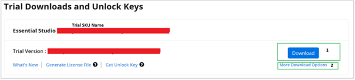
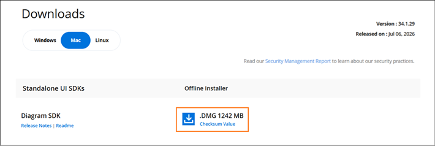

---
layout: post
title: Downloading Syncfusion Diagram SDK Mac Installer
description: Learn how to download the Syncfusion Diagram SDK Mac installer from the Syncfusion website using your license.
platform: Diagram-SDK
control: Installation and Deployment
documentation: ug
--- 

# Downloading Syncfusion Diagram SDK Mac Installer

The Syncfusion installer can be downloaded from the [Syncfusion](https://www.syncfusion.com/) website. You can either download the licensed installer or try our trial installer depending on your license.

   -	Trial Installer
   -	Licensed Installer

You can download the Syncfusion installer from [Syncfusion.com](https://www.syncfusion.com/) website 

## Download the Trial Version

Our 30-day trial can be downloaded in two ways:

* Download the free trial setup.
* Start a trial if you are using components through [NuGet.org](https://www.nuget.org/packages?q=syncfusion).

### Download Free Trial Setup

1. You can evaluate our 30-day free trial by visiting the [Download Free Trial](https://www.syncfusion.com/downloads) page and select the product
2. After completing the required form or logging in with your registered Syncfusion account, you can download the trial installer from the confirmation page. (as shown in below screenshot.)

3. With a trial license, only the latest version's trial installer can be downloaded.
4. Before the trial expires, you can download the trial installer at any time from your registered account's [Trials and Downloads](https://www.syncfusion.com/account/manage-trials/downloads) page (as shown in the screenshot below).

   

5. Click **More Download Options** (element 2 in the screenshot above) to get the Syncfusion Diagram SDK Mac trial installer, which is available in `.pkg` format.

   

### Start trials if using components through NuGet.org

If you have already obtained Syncfusion components through [NuGet.org](https://www.nuget.org/packages?q=syncfusion), you should initiate an evaluation before using them in production.

1. Start your 30-day free trial from the [Start Trial](https://www.syncfusion.com/account/manage-trials/start-trials) page in your account.

   > You can generate the license key for your active trial products from the [Trials and Downloads](https://www.syncfusion.com/account/manage-trials/downloads) page. This license key is mandatory to use our trial products in your application. To learn more, refer to the [licensing overview](https://help.syncfusion.com/file-formats/licensing/overview).

   

2. To access this page, you must sign up or log in with your Syncfusion account.
3. Begin your trial by selecting **Syncfusion Diagram SDK**.

   > If you have already used the trial for Syncfusion Diagram SDK and it has not expired, you cannot start the trial for the same product again.

   N> If you've already used the trial products and they haven't expired, you won't be able to start the trial for the same product again.

   

5. You can find your current active trial products on the [Trials and Downloads](https://www.syncfusion.com/account/manage-trials/downloads) page.

5. You can find your current active trial products on the [Trials & Downloads](https://www.syncfusion.com/account/manage-trials/downloads) page.
   

   

5. The Unlock key is not required to install the Syncfusion Diagram SDK Mac licensed installer.
6. For macOS, the `.pkg` format is available for download.

   
   
4. Unlock key is not required to install the Syncfusion Diagram SDK Mac trial installer.   
5. For Mac OS, PKG formats is available for download.
   
   

You can also refer to the [**Diagram SDK Mac installer**](https://help.syncfusion.com/common/essential-studio/installation/mac-installer/how-to-install) links for step-by-step installation guidelines.	
