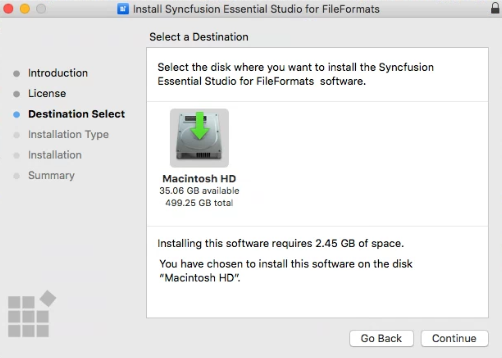
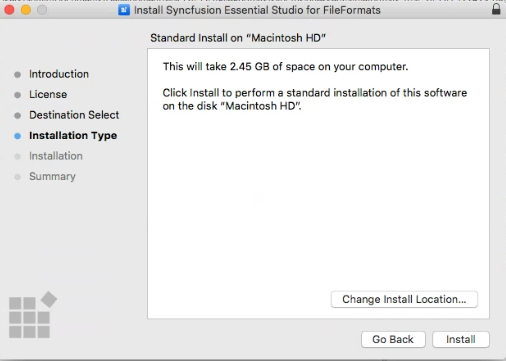

# Installing Syncfusion Diagram SDK Mac installer

## Steps to resolve the warning message in Catalina OS or later

When you run the Syncfusion Diagram SDK Mac installer on Catalina macOS or later, the following alert is displayed.

If you receive this alert, follow these steps for the easiest solution.

1. Right-click the downloaded `.pkg` file.
2. Select **Open With** and choose **Installer** (default). The following pop-up appears.

   

3. Clicking **Open** opens the installer window.

> On newer macOS versions, you may need to approve the package in **System Settings → Privacy & Security** → **Open Anyway**.

## Step-by-step installation

The steps below show how to install the Syncfusion Diagram SDK Mac installer.

1. Open the downloaded `.pkg` file from Finder (default location: `~/Downloads`). The installer wizard opens. Click **Continue**.

   

2. The Software License Agreement wizard appears. Click **Continue**.

   

3. The License Agreement confirmation window appears. If you have read the agreement, click **Agree**.

   

4. The Select Destination wizard appears. Choose the volume on which to install the Syncfusion Diagram SDK Mac installer.

   

5. The Installation Type wizard appears. Click **Install** to begin the standard installation. If you want to customize the components, click **Customize** before installing.

   

6. The Authentication window appears. Enter the Mac administrator password and click **Install Software**.

   

7. The installation begins on your machine.

   

8. When the installation is complete, the summary screen is displayed. Click **Close** to exit the installer wizard.

   
   
   By default, Mac installer will install the files in following location.

   **Location:** {Documents}/Syncfusion/{version}/Diagram SDK
   
   

## License key registration in samples

After the installation, the license key is required to register the demo source included in the Mac installer. For license registration steps, refer to the [Syncfusion licensing documentation](https://help.syncfusion.com/file-formats/licensing/overview).

* Register the license key in the [Program.cs](https://ej2.syncfusion.com/aspnetcore/documentation/licensing/how-to-register-in-an-application#for-aspnet-core-application-using-net-60) file if you created the ASP.NET Core web application with Visual Studio 2022 and .NET 6.0.
* Register the license key in Configure method of [Startup.cs](https://ej2.syncfusion.com/aspnetcore/documentation/licensing/how-to-register-in-an-application#for-aspnet-core-application-using-net-50-or-net-31)