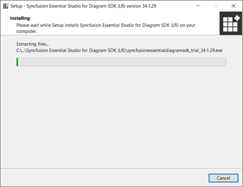
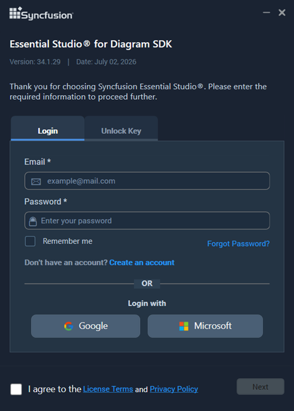
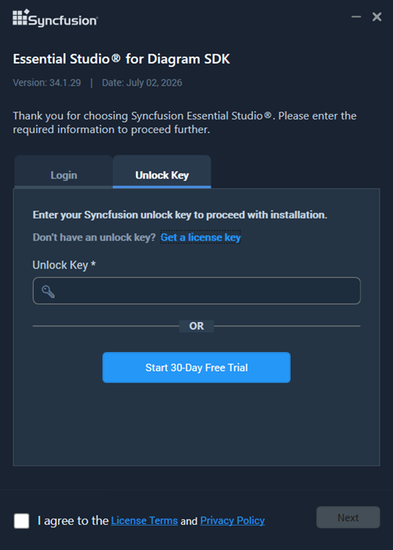
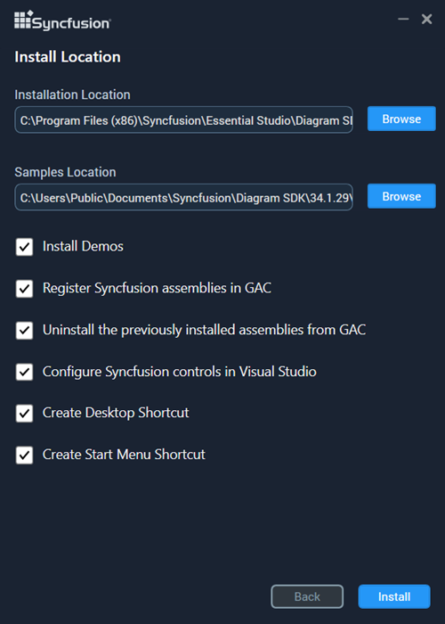
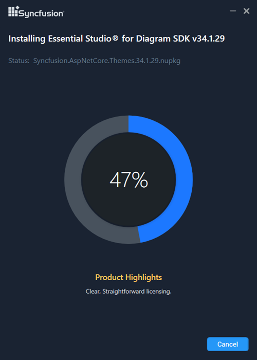
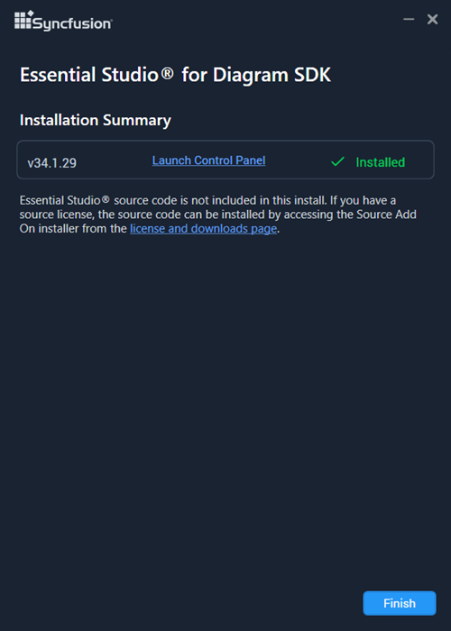

# Installing Syncfusion Diagram SDK offline installer

## Installing with UI

The steps below show how to install the Syncfusion Diagram SDK offline installer.

1. Open the Syncfusion Diagram SDK offline installer file from the downloaded location by double-clicking it. The installer wizard opens and extracts the package.

   

   > The installer extracts `syncfusionessentialdiagramsdk_<version>.exe` to a temporary dialog that shows the package extraction progress.

2. To unlock the Syncfusion offline installer, choose one of two options:

   * **Login To Install**
   * **Use Unlock Key**

   **Login To Install**

   Enter your Syncfusion email address and password. If you do not have a Syncfusion account, click **Create an account** to register. If you have forgotten your password, click **Forgot Password** to reset it. After entering your credentials, click **Next**.

   

   **Use Unlock Key**

   Unlock keys unlock the Syncfusion offline installer and are platform- and version-specific. Use either a licensed or a trial unlock key to unlock the Syncfusion Diagram SDK installer.

   The trial unlock key is valid for 30 days, and the installer rejects expired trial keys.

   For more information on generating an unlock key for both trial and licensed products, see the [Syncfusion unlock key KB article](https://www.syncfusion.com/kb/2326).

   

3. Read the License Terms and Privacy Policy, select the **I agree to the License Terms and Privacy Policy** check box, and click **Next**.

4. Change the install and sample locations as needed. You can also change the additional settings (see the next subsection). Click **Next** or **Install** to install with the default settings.

   

### Additional settings

The following check boxes are available on the install location screen:

* **Install Demos** – Installs the Syncfusion sample applications. Default: enabled.
* **Register Syncfusion Assemblies in GAC** – Installs the latest Syncfusion assemblies in the Global Assembly Cache. Default: enabled.
* **Configure Syncfusion controls in Visual Studio** – Configures the Syncfusion controls in the Visual Studio toolbox. Requires **Register Syncfusion Assemblies in GAC** to be selected. Default: enabled.
* **Configure Syncfusion Extensions in Visual Studio** – Configures the Syncfusion extensions in Visual Studio. Default: enabled.
* **Create Desktop Shortcut** – Adds a desktop shortcut for the Syncfusion Control Panel. Default: enabled.
* **Create Start Menu Shortcut** – Adds a start menu shortcut for the Syncfusion Control Panel. Default: enabled.

5.	If any previous versions of the current product is installed, the Uninstall Previous Version(s) wizard will be opened. Select **Uninstall** checkbox to uninstall the previous versions and then click the Proceed button.

    
	
	
	N> From the 2021 Volume 1 release, Syncfusion has added the option to uninstall previous versions from 18.1 while installing the new version.
	
	
	N> If any version is selected to uninstall, a confirmation screen will appear; if continue is selected, the Progress screen will display the uninstall and install progress, respectively. If none of the versions are chosen to be uninstalled, only the installation progress will be displayed.
	
	**Uninstall Progress:**
	
	
	
	**Install Progress**
	
	

   > The **Completed** screen is displayed once the Diagram SDK product is installed. If a version was selected to uninstall, the **Completed** screen shows both install and uninstall status.

   

6. After installation, click the **Launch Control Panel** link to open the Syncfusion Control Panel (used to manage licenses, downloads, and installed products).

1. Open **Syncfusion Control Panel** from the desktop or start menu.
2. Confirm **Syncfusion Diagram SDK** appears in the installed products list.
3. Navigate to the install location (default `C:\Program Files (x86)\Syncfusion\Essential Studio\Diagram SDK\<version>`) and confirm the `Samples` and `NuGet` folders are present.

## Installing in silent mode

The Syncfusion Diagram SDK installer supports installation and uninstallation via the command line.

### Command Line Installation

To install through the Command Line in Silent mode, follow the steps below.

1.	Run the Syncfusion Diagram SDK installer by double-clicking it. The Installer Wizard automatically opens and extracts the package.
2.	The file syncfusionessentialdiagramsdk_(version).exe file will be extracted into the Temp directory.
3.	Run %temp%. The Temp folder will be opened. The syncfusionessentialdiagramsdk_(version).exe file will be located in one of the folders.
4.	Copy the extracted syncfusionessentialdiagramsdk_(version).exe file in local drive.
5.	Exit the Wizard.
6.	Run Command Prompt in administrator mode and enter the following arguments.

   
    **Arguments:** “installer file path\SyncfusionEssentialStudio(platform)_(version).exe” /Install silent /UNLOCKKEY:“(product unlock key)” [/log “{Log file path}”] [/InstallPath:{Location to install}] [/InstallSamples:{true/false}] [/InstallAssemblies:{true/false}] [/UninstallExistAssemblies:{true/false}] [/InstallToolbox:{true/false}]

    N> [..] – Arguments inside the square brackets are optional.

    **Example:** “D:\Temp\syncfusionessentialdiagramsdk_x.x.x.x.exe” /Install silent /UNLOCKKEY:“product unlock key” /log “C:\Temp\EssentialStudio_Platform.log” /InstallPath:C:\Syncfusion\x.x.x.x /InstallSamples:true /InstallAssemblies:true /UninstallExistAssemblies:true /InstallToolbox:true

	
7.  Essential Studio for Diagram SDK is installed.

    N> x.x.x.x should be replaced with the Essential Studio version and the Product Unlock Key needs to be replaced with the Unlock Key for that version.
   

### Command Line Uninstallation

Syncfusion Diagram SDK can be uninstalled silently using the command line.

1.	Run the Syncfusion Diagram SDK installer by double-clicking it. The Installer Wizard automatically opens and extracts the package.
2.	The file syncfusionessentialdiagramsdk_(version).exe file will be extracted into the Temp directory.
3.	Run %temp%. The Temp folder will be opened. The syncfusionessentialdiagramsdk_(version).exe file will be located in one of the folders.
4.	Copy the extracted syncfusionessentialdiagramsdk_(version).exe file in local drive.
5.	Exit the Wizard.
6.	Run Command Prompt in administrator mode and enter the following arguments.
   
    **Arguments:** “Copied installer file path\syncfusionessentialdiagramsdk_(version).exe” /uninstall silent 

    **Example:** “D:\Temp\syncfusionessentialdiagramsdk_x.x.x.x.exe" /uninstall silent

7.  Essential Studio for Diagram SDK is uninstalled.
   
   
