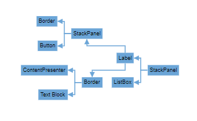

# Mind Map layout in JavaScript Diagram control

A mind map is a diagram that displays the nodes as a spider diagram organizes information around a central concept. To create mind map, the [`type`](../../api/diagram/layout#type) of layout should be set as `MindMap`.

## Mind Map Orientation

An [`Orientation`](../../api/diagram/orientation) of a `MindMapTreeLayout` is used to arrange the tree layout according to a specific direction. By default, the orientation is set to Horizontal. 

The following code example illustrates how to create an mindmap layout.









        


The following table outlines the various orientation types available:

|Orientation Type |Description|
| -------- | ----------- |
|Horizontal|Aligns the tree layout from left to right|
|Vertical|Aligns the tree layout from top to bottom|

N> If you want to use mind map layout in diagram, you need to inject MindMap in the diagram.

## Mind Map branch

You can also decide the branch for mind map using [`getBranch`](../../api/diagram/layoutModel#getbranch) method. The following code demonstrates how to set all branches on the right side for mind map layout using `getBranch` method.









        


