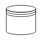

# BPMN Data source in TypeScript Diagram control

## Datasource

Datasource is used to store or access data associated with a business process. To create a datasource, set the shape as **datasource**. The following code example illustrates how to create a datasource.

 







        


