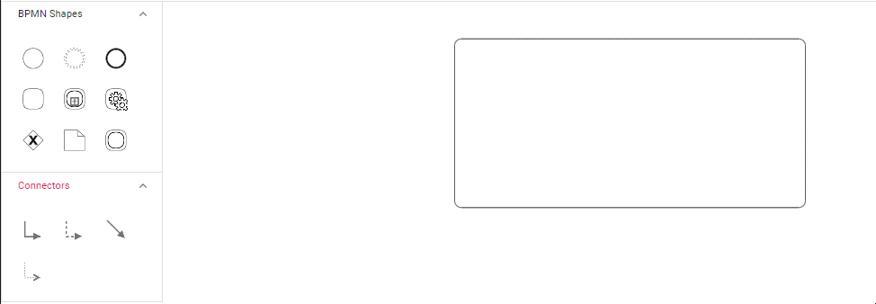

# Expanded SubProcess in TypeScript Diagram control
An expanded subProcess can contain certain child processess within it.

### Create BPMN Expanded subProcess

To create expanded subProcess, set shape as [`activity`](https://ej2.syncfusion.com/documentation/api/diagram/bpmnActivityModel)  and [`collapsed`](https://ej2.syncfusion.com/documentation/api/diagram/bpmnSubProcessModel#collapsed) as false. Enable [`AllowDrop`](https://ej2.syncfusion.com/documentation/api/diagram/nodeConstraints) constraint for node to allow child to drop inside the expanded subProcess.

 







        


### Add BPMN nodes into ExpandedSubProcess

[`Processes`](https://ej2.syncfusion.com/documentation/api/diagram/bpmnSubProcessModel#processes) is an array collection that defines the children values for BPMN subprocess.

Please refer the following code example.

 







        


### Add BPMN nodes into ExpandedSubProcess at runtime

Drag and drop the BPMN nodes to the BPMN ExpandedSubProcess.
While resizing or dragging the child element, if the child element bounds are within the ExpandedSubProcess bounds, the ExpandedSubProcess size will be updated along with that.

The following image shows how to add BPMNNode into the BPMN ExpandedSubProcess at runtime.

#### Add/remove Process Programmatically

The process for the expanded sub-process can be added at runtime using the [`addProcess`](https://ej2.syncfusion.com/documentation/api/diagram#addprocess) method and removed at runtime using the [`removeProcess`](https://ej2.syncfusion.com/documentation/api/diagram#removeprocess) method. The following example shows how to add and remove a process at runtime.

 







        


