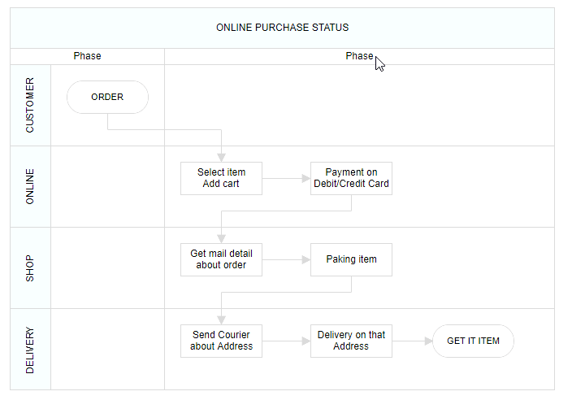

## Phase

 Phase are the subprocess which will split each lanes as horizontally or vertically based on the swimlane orientation. We can add multiple number of [`Phase`](https://ej2.syncfusion.com/documentation/api/diagram/phaseModel) to swimlane.

The following code example illustrates how to create phase.

 







        


### Dynamically add/remove phase to Lane

 You can add the a phase at runtime by using [`addPhases`](https://ej2.syncfusion.com/documentation/api/diagram#addphases) method and remove phase by using [`removePhase`](https://ej2.syncfusion.com/documentation/api/diagram#removephase) method. The following code example illustrates how to add and remove phase at run time.

 







        


### Customizing phase

* The length of region can be set by using the  [`offset`](https://ej2.syncfusion.com/documentation/api/diagram/phaseModel#offset) property of the phase.
* Every phase region can be textually described with the [`header`](https://ej2.syncfusion.com/documentation/api/diagram/headerModel) property of the phase.
* You can increase the height of phase by using [`phaseSize`](https://ej2.syncfusion.com/documentation/api/diagram/swimLaneModel#phaseSize) property of swimlane.
* We can provide additional information to the phase by using the [`addInfo`](https://ej2.syncfusion.com/documentation/api/diagram/phasemodel#addinfo) property of the phase.

The following code example illustrates how to customize the phase in swimlane.

 







        


#### Dynamic customization of phase

 You can customize the phase style and text properties dynamically. The following code illustrates how to dynamically customize the phase.

 The following code example illustrates how to customize the phase at runtime.

 







        


### Phase interaction

#### Resizing

* The phase can be resized by using its selector.
* You must select the phase header to enable the phase selection.
* Once the phase can be resized, the lane size will be updated automatically.

#### Resizing helper

* The special resize selector will be used to resize the phase.
* The resize cursor will be available on the left and bottom direction for horizontal, and the top and bottom direction for vertical swimlane.

#### Phase header editing

Diagram provides the support to edit phase headers at runtime. We achieve the header editing by double click event. Double clicking the header label will enables the editing of that. The following image illustrates how to edit the swimlane header.The following image illustrates how to edit the phase header. 
