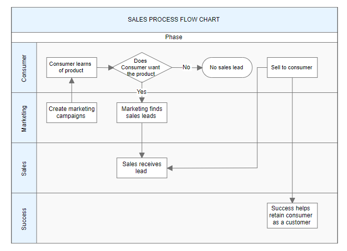
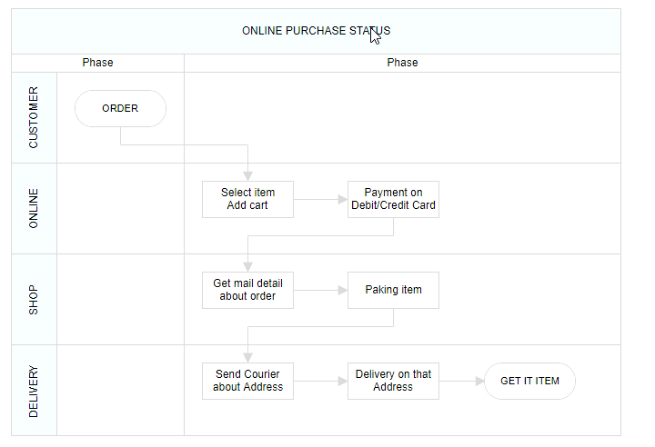

# Swim lane in TypeScript Diagram control

A swimlane is a type of diagram node commonly used to visualize the relationship between a business process and the department responsible for it. It focuses on illustrating the logical connections between activities, making it simpler to grasp the dynamics of the process and the corresponding departmental responsibilities.

## Create a swimlane

To create a swimlane,the type of shape should be set as [`swimlane`](https://ej2.syncfusion.com/documentation/api/diagram/swimLaneModel). By Default swimlane's are arranged horizontally.

The following code example illustrates how to define a swimlane object.

 







        


N> When setting a Swimlane's ID, ensure that it does not contain white spaces, does not start with numbers or special characters, and does not include special characters like underscores (_) or spaces.

## Headers

Header was the primary element for swimlanes. The [`header`](https://ej2.syncfusion.com/documentation/api/diagram/headerModel) property of swimlane allows you to define its textual description and to customize its appearance.

N> By using this header, the swimlane interaction will be performed, like selection, dragging,etc.

The following code example illustrates how to define a swimlane header.

 







        


### Customization of headers

The height and width of swimlane header can be customized with [`width`](https://ej2.syncfusion.com/documentation/api/diagram/headerModel#width) and [`height`](https://ej2.syncfusion.com/documentation/api/diagram/headerModel#height) properties of swimlane header. set fill color of header by using the [`style`](https://ej2.syncfusion.com/documentation/api/diagram/textstylemodel) property. The orientation of swimlane can be customized with the [`orientation`](https://ej2.syncfusion.com/documentation/api/diagram/orientation) property of the header.

N> By default the swimlane orientation has Horizontal.

The following code example illustrates how to customize the swimlane header.

 







        


#### Dynamic customization of swimlane header

 You can customize the swimlane header style and text properties dynamically. The following code illustrates how to dynamically customize the swimlane header.

 







        


### Header editing

Diagram provides the support to edit swimlane headers at runtime. We achieve the header editing by double click event. Double clicking the header label will enables the editing of that. The following image illustrates how to edit the swimlane header. .

## Orientation

Swimlanes can be oriented in two ways: horizontally or vertically. This flexibility allows for versatile visualization of business processes and departmental relationships.

 







        


## Limitations

* Connectors cannot be added directly to swimlane.