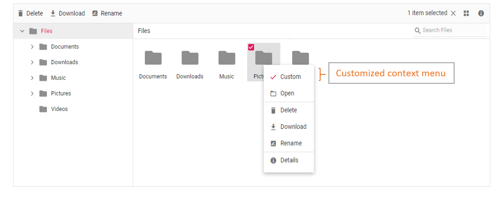

# How to add custom menu item in context menu

The context menu can be customized using the `contextMenuSettings`,`menuOpen`, and `menuClick` events.

The following example shows adding a custom item in the context menu.

The `menuOpen` event is used to add the new menu item. The `menuClick` event is used to add event handler to the new menu item.
























The output will look like the image below.

