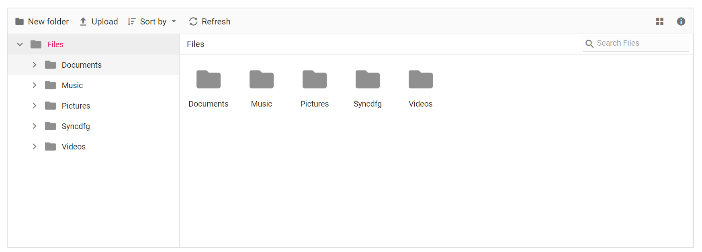
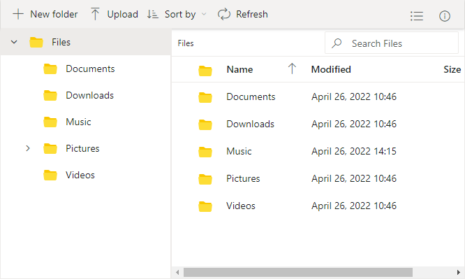

# Views in File Manager Control

The view section displays files and folders for user browsing. The `view` API can also be used to change the initial view of the File Manager.

The File Manager has two types of `views` to display the files and folders.

* [LargeIcons View](#largeicons-view)
* [Details View](#details-view)

## LargeIcons View

By default, File Manager is rendered with the largeicons view. The following example demonstrates this.
























The output will look like the image below.

### Customize existing Large Icons View

The large icons view layout can be customized using the `largeIconsTemplate` property, which allows you to display file or folder information, apply custom formatting, and use conditional rendering based on item type. You can customize it further based on your application requirements.
























## Details View

The default appearance of the File Manager can be changed from largeicons to details view by using the `view` property. In the Details view, the files are displayed in a sorted list order. This file list comprises of several columns of information about the files such as **Name**, **Date Modified**, **Type**, and **Size**. The following example demonstrates the File Manager with details view.
























The output will look like the image below.

