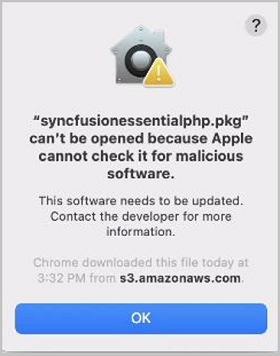
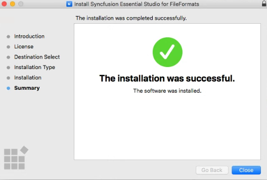

# Installing the Syncfusion File Manager SDK on macOS

## Steps to resolve the warning message in Catalina OS or later

While running the Syncfusion Chart SDK Mac Installer on Catalina macOS or later, the alert below is displayed.



If you receive this alert, follow the steps below for the easiest solution.

1. Right-click the downloaded `.pkg` file in Finder.
2. Select the **Open With** option and choose **Installer (default)**. The pop-up shown below appears.

   

3. Click **Open**. The installer window opens.

## Step-by-Step Installation

The steps below show how to install Essential Studio File Manager SDK Mac installer.

1. Open the Syncfusion Essential Studio File Manager SDK Mac installer(.pkg) file. The installer Wizard opens. Click Continue.

   
   

2. The Software License Agreement wizard will appear. Click the Continue button.

      
   

3. The License Agreement's Confirmation window will appear. If you have read the Software License Agreement, click **Agree**.

   
   
   N> The Unlock key is not required to install the Essential Studio File Manager SDK Mac installer.


4. The Destination select wizard will appear. You can choose which disc to install the Syncfusion Essential Studio File Manager SDK Mac installer on here.

   

5. The Installation Type wizard will appear. Click Install to begin the standard installation of the Syncfusion Essential Studio File Manager SDK Mac installer.

   

6. The Authentication window will appear. To begin the installation, enter the Mac machine's password and click **Install Software**.

   

7. The installation process will begin on your machine. 
   
   
   
8. Once the installation is complete, the completed screen will be displayed. To exit the installation wizard, click Close. 

   

### Default Installation Location

By default, the Mac Installer installs the following files:

* **Demo samples** – ASP.NET Core File Manager SDK sample source.
* **NuGet packages** – Pre-built Syncfusion NuGet packages.
* **Source** – Component source code for advanced scenarios.

```text
Location: {Documents}/Syncfusion/{version}/File Manager SDK
```

Replace `{version}` with the installed Syncfusion version (for example, `26.1.35`). `{Documents}` is the Documents folder of the user who ran the installer.


## License key registration in samples

After the installation, the license key is required to register the demo source that is included in the Mac installer. To learn about the steps for license registration for the ASP.NET Core - EJ2 samples in the Essential Studio File Manager SDK Mac installer, please refer to this.

* Register the license key in the [Program.cs](https://ej2.syncfusion.com/aspnetcore/documentation/licensing/how-to-register-in-an-application#for-aspnet-core-application-using-net-60) file if you created the ASP.NET Core web application with Visual Studio 2022 and .NET 6.0.
* Register the license key in Configure method of [Startup.cs](https://ej2.syncfusion.com/aspnetcore/documentation/licensing/how-to-register-in-an-application#for-aspnet-core-application-using-net-50-or-net-31)