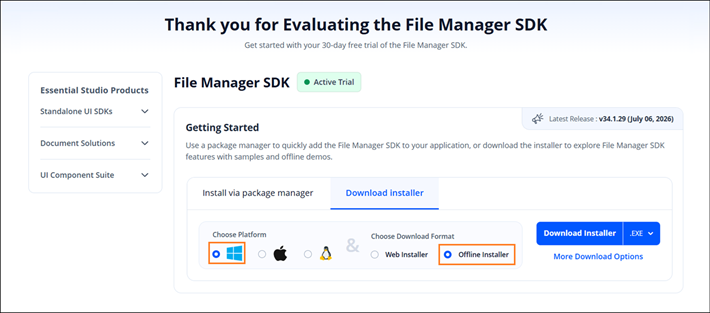
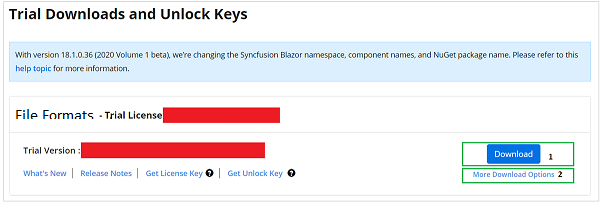
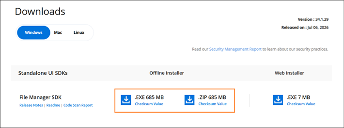
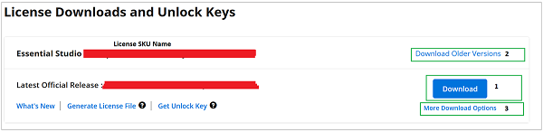

# Downloading the Syncfusion File Manager SDK Offline Installer

You can either download the licensed installer or try our trial installer depending on your license type.

> **Note:** The Windows offline installer is available in **EXE** and **ZIP** formats and supports Windows 10, Windows 11, and Windows Server 2016 or later (x64). The EXE is a guided installer; the ZIP is a portable archive for manual placement. Ensure you have sufficient disk space and administrator privileges before installing.

## Download the Trial Version

Our 30-day trial can be downloaded in two ways.

* Download the Free Trial Setup
* Start Trials if using components through [NuGet.org](https://www.nuget.org/packages?q=syncfusion)

### Download the Free Trial Setup

1. You can evaluate our 30-day free trial by visiting the [Download Free Trial](https://www.syncfusion.com/downloads) page and selecting the **File Manager SDK** product.
2. After completing the required form or logging in with your registered Syncfusion account, you can download the File Manager SDK trial installer from the confirmation page (as shown in the following screenshot).
   
   
   
3. With a trial license, only the latest version's trial installer can be downloaded.
4. After downloading, the Syncfusion File Manager SDK trial installer can be unlocked using either the trial unlock key or the Syncfusion registered login credential. More information on generating an unlock key can be found in this [How to generate an unlock key](https://support.syncfusion.com/kb/article/7053/how-to-generate-unlock-key-for-essentials-studio-products) article.
5. Before the trial expires, you can download the trial installer at any time from your registered account's [Trials & Downloads](https://www.syncfusion.com/account/manage-trials/downloads) page (as shown in the following screenshot).
 
   

6. Click the More Download Options (element 2 in the above screenshot) button to get the Essential Studio File Manager SDK Offline trial installer which is available in EXE and ZIP format.

   
   
### Start Trials if using components through [NuGet.org](https://www.nuget.org/packages?q=syncfusion)

You should initiate an evaluation if you have already obtained our components through [NuGet.org](https://www.nuget.org/packages?q=syncfusion).

1. You can start your 30-day free trial for the File Manager SDK from your account via the [Start Trial](https://www.syncfusion.com/account/manage-trials/start-trials) page.
   
   
   
2. To access this page, you must sign up / log in with your Syncfusion account.
3. Begin your trial by selecting the **File Manager SDK** product. 

   > **Note:** If you've already used the trial products and they haven't expired, you won't be able to start the trial for the same product again.

4. After you've started the trial, go to the [Trials & Downloads](https://www.syncfusion.com/account/manage-trials/downloads) page to get the latest version trial installer. You can generate the [unlock key](https://support.syncfusion.com/kb/article/7053/how-to-generate-unlock-key-for-essentials-studio-products) and [license key](https://help.syncfusion.com/file-formats/licensing/how-to-generate) here at any time before the trial period expires (as shown in the following screenshot).

   

6. You can find your current active trial products on the [Trials & Downloads](https://www.syncfusion.com/account/manage-trials/downloads) page.
   

## Download the License Version

1. Syncfusion licensed products will be available on the [License & Downloads](https://www.syncfusion.com/account/downloads) page under your registered Syncfusion account.
2. You can view all the licenses (both active and expired) associated with your account.
3. Select the **File Manager SDK** product and choose the **Windows** platform to filter the available downloads.
4. Click the **Download** button (element 1 in the following screenshot) to download the respective product's installer. The most recent version of the installer is downloaded by default.
5. To download older version installers, go to [Downloads Older Versions](https://www.syncfusion.com/account/downloads/studio) (element 2 in the following screenshot) and choose the desired version.
6. You can download other platform / add-on installers by going to **More Download Options** (element 3 in the following screenshot).

   
7. For Windows OS, EXE and Zip formats are available for download. They are both Offline Installers.
   
   

You can also refer to the [**File Manager SDK Offline Installer**](https://help.syncfusion.com/filemanager-sdk/installation/offline-installer/how-to-install) link for step-by-step installation guidelines.
	