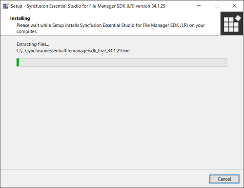
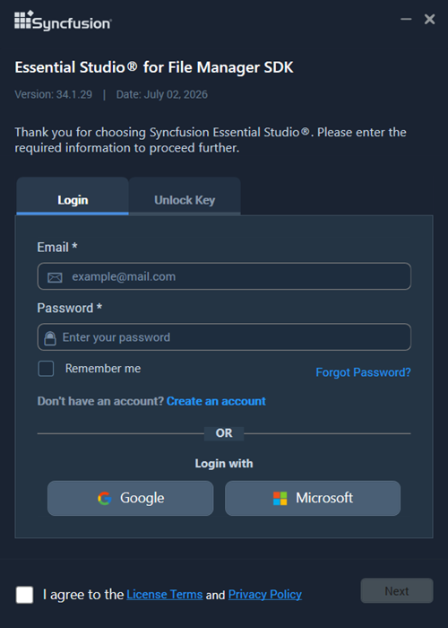
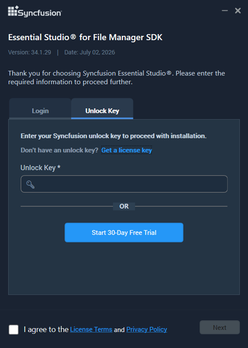
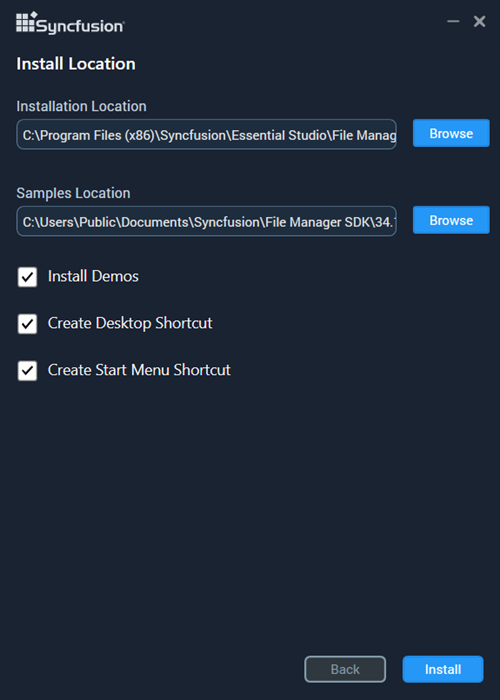
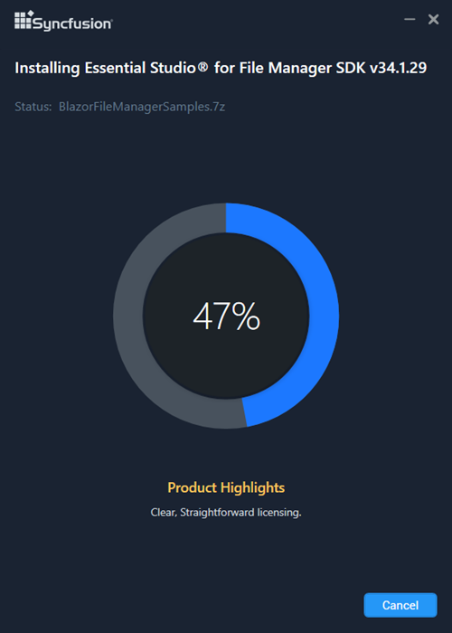
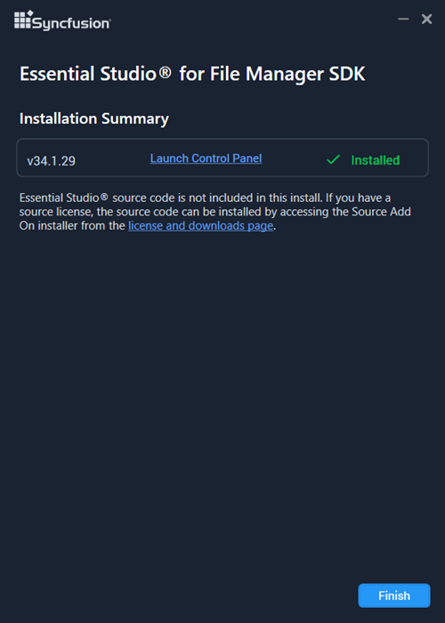

# Installing Syncfusion File Manager SDK offline installer

## Installing with UI

The steps below show how to install the Syncfusion File Manager SDK Offline Installer.

1.	Double-click the downloaded Syncfusion File Manager SDK offline installer file from the downloaded location. The installer wizard opens and extracts the package. Wait for the extraction to complete.

    

    N> The Installer wizard extracts the syncfusionessentialfilemanagersdk_(version).exe dialog, which displays the package's unzip operation.

2.	To unlock the Syncfusion offline installer, you have two options:

   
    * *Login To Install*
   
    * *Use Unlock Key*
   
   
   
    **Login To Install**
   
    You must enter your Syncfusion email address and password. If you don't already have a Syncfusion account, you can sign up for one by clicking **"Create an account"**. If you have forgotten your password, click on **"Forgot Password"** to create a new one. Once you've entered your Syncfusion email and password, click Next.

       

    #### Use Unlock Key

    Unlock keys authorize the Syncfusion offline installer and are platform- and version-specific. Use either a Syncfusion licensed unlock key or a trial unlock key to unlock the File Manager SDK installer. The trial unlock key is valid for 30 days; the installer does not accept an expired trial key.

    To learn how to generate an unlock key for both trial and licensed products, see [How to generate an unlock key](https://www.syncfusion.com/kb/2326).

       

3.	After reading the [License Terms](https://www.syncfusion.com/sales/license) and [Privacy Policy](https://www.syncfusion.com/privacy), select the **I agree to the License Terms and Privacy Policy** check box. Click **Next**.

    

    #### Additional Settings

    * Select **Install Demos** to install the Syncfusion File Manager SDK samples, or clear it to skip the samples.
    * Select **Register Syncfusion Assemblies in GAC** to install the latest Syncfusion assemblies in the Global Assembly Cache (GAC), or clear it to skip GAC registration.
    * Select **Configure Syncfusion controls in Visual Studio** to add the Syncfusion controls to the Visual Studio toolbox. This option requires both **Register Syncfusion Assemblies in GAC** and a supported Visual Studio version to be enabled.
    * Select **Configure Syncfusion Extensions in Visual Studio** to register the Syncfusion Extensions in Visual Studio, or clear it to skip extension registration.
    * Select **Create Desktop Shortcut** to add a desktop shortcut for the Syncfusion Control Panel.
    * Select **Create Start Menu Shortcut** to add a Start menu shortcut for the Syncfusion Control Panel.

5.	If any previous versions of the current product are installed, the **Uninstall Previous Version(s)** wizard appears. Select the **Uninstall** check box next to the versions you want to remove, then click **Proceed**.
	
    > **Note:** From the 2021 Volume 1 release onwards, Syncfusion provides the option to uninstall previous versions (18.1 and later) while installing the new version.
	
	
    ##### Confirmation Alert
	
    
	
    ##### Uninstall Progress
	
    
	
    ##### Install Progress
	
    

    > **Note:** The **Completed** screen is displayed once the File Manager SDK is installed. If any version was selected to uninstall, the completed screen displays both install and uninstall status.
	
    
	
7.  After installation, click **Launch Control Panel** to open the Syncfusion Control Panel, where you can manage license keys and samples.

8.  Click **Finish**. The Syncfusion File Manager SDK is now installed on your system.

## Installing in Silent Mode

The Syncfusion File Manager SDK Installer supports installation and uninstallation via the command line.

### Command Line Installation

To install through the command line in silent mode, follow the steps below.

1.	Run the Syncfusion File Manager SDK installer by double-clicking it. The installer wizard opens and extracts the package.
2.	The file `syncfusionessentialfilemanagersdk_<version>.exe` is extracted into the Temp directory.
3.	Open the Temp folder by pressing <kbd>Win</kbd>+<kbd>R</kbd>, typing `%temp%`, and pressing <kbd>Enter</kbd>. The `syncfusionessentialfilemanagersdk_<version>.exe` file is located in one of the folders.
4.	Copy the extracted `syncfusionessentialfilemanagersdk_<version>.exe` file to a local drive.
5.	Exit the wizard.
6.	Open Command Prompt in **administrator** mode and run the following command:

   
    **Arguments:** “installer file path\SyncfusionEssentialStudio(platform)_(version).exe” /Install silent /UNLOCKKEY:“(product unlock key)” [/log “{Log file path}”] [/InstallPath:{Location to install}] [/InstallSamples:{true/false}] [/InstallAssemblies:{true/false}] [/UninstallExistAssemblies:{true/false}] [/InstallToolbox:{true/false}]

    N> [..] – Arguments inside the square brackets are optional.

    **Example:** “D:\Temp\syncfusionessentialfilemanagersdk_x.x.x.x.exe” /Install silent /UNLOCKKEY:“product unlock key” /log “C:\Temp\EssentialStudio_Platform.log” /InstallPath:C:\Syncfusion\x.x.x.x /InstallSamples:true /InstallAssemblies:true /UninstallExistAssemblies:true /InstallToolbox:true

	
7.  Essential Studio for File Manager SDK is installed.

    > **Note:** Replace `<version>` (for example, `26.1.35`) with your installed Syncfusion version, and `<product-unlock-key>` with the unlock key for that version.

### Command Line Uninstallation

The Syncfusion File Manager SDK can be uninstalled silently using the command line.

1.	Run the Syncfusion File Manager SDK installer by double-clicking it. The Installer Wizard automatically opens and extracts the package.
2.	The file syncfusionessentialfilemanagersdk_(version).exe file will be extracted into the Temp directory.
3.	Run %temp%. The Temp folder will be opened. The syncfusionessentialfilemanagersdk_(version).exe file will be located in one of the folders.
4.	Copy the extracted syncfusionessentialfilemanagersdk_(version).exe file in local drive.
5.	Exit the Wizard.
6.	Run Command Prompt in administrator mode and enter the following arguments.
   
    **Arguments:** “Copied installer file path\syncfusionessentialfilemanagersdk_(version).exe” /uninstall silent 

    **Example:** “D:\Temp\syncfusionessentialfilemanagersdk_x.x.x.x.exe" /uninstall silent

7.  Essential Studio for File Manager SDK is uninstalled.
   
   
