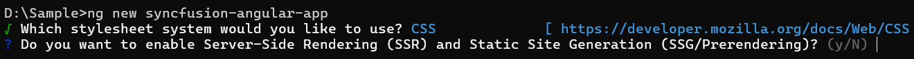

# Getting Started with Angular Kanban Component

The Syncfusion Angular Kanban component is a workflow visualization tool that helps to organize, manage, and track tasks across different stages of a process. This section outlines the steps to create a basic Kanban board in Angular and configure its core features.

> **Ready to streamline your Syncfusion<sup style="font-size:70%">&reg;</sup> Angular development?** Discover the full potential of Syncfusion<sup style="font-size:70%">&reg;</sup> Angular components with Syncfusion<sup style="font-size:70%">&reg;</sup> AI Coding Assistant. Effortlessly integrate, configure, and enhance your projects with intelligent, context-aware code suggestions, streamlined setups, and real-time insights—all seamlessly integrated into your preferred AI-powered IDEs like VS Code, Cursor, Syncfusion<sup style="font-size:70%">&reg;</sup> CodeStudio and more. [Explore Syncfusion<sup style="font-size:70%">&reg;</sup> AI Coding Assistant](https://ej2.syncfusion.com/angular/documentation/ai-coding-assistant/overview)

## Overview

The Kanban component consists of the following elements:
- **Cards**: Represent tasks and are mapped to a `dataSource` via `cardSettings`.
- **Columns**: Define workflow stages and are mapped using the `keyField` property.
- **Swimlanes**: Group cards based on categories and are configured using `swimlaneSettings`.

> Note: The example in this section uses only cards and columns. To enable swimlanes, see the [Swimlanes documentation](swimlane).

## Setting Up the Angular Environment

Angular 21 requires Node.js 20.11+ (or 22.0+) and npm. Verify your versions before proceeding:

```bash
node -v
npm -v
```

Use the [Angular CLI](https://github.com/angular/angular-cli) to create and manage Angular applications. Install Angular CLI using the following command:

```bash
npm install -g @angular/cli@21.0.1
```

## Create an Angular Application

Create a new Angular application using the Angular CLI:

```bash
ng new my-app
```
This command prompts for a few settings for the new project, such as whether to add Angular routing and which stylesheet format to use.


By default, the application uses CSS for styling.

The CLI also displays an additional prompt asking whether to enable Server-Side Rendering (SSR) and Static Site Generation (SSG), as shown below:



For this setup, select **No**, as the Kanban does not require SSR or SSG for basic configuration.

Next, a prompt for AI tooling support appears, as shown below:


Any preferred option can be selected based on the development workflow or project needs.

> Note: Angular CLI 17+ creates the root component file as `src/app/app.ts` (not `app.ts`). All file paths in this guide use this default naming.

Navigate to the project folder:

```bash
cd my-app
```

## Adding the Syncfusion<sup style="font-size:70%">&reg;</sup> Kanban Package

All available Essential JS 2 packages are published in the [npmjs.com](https://www.npmjs.com/~syncfusionorg) registry. Use a package version that is compatible with Angular 21 (for example, `@syncfusion/ej2-angular-kanban@^21` or later).

Install the Kanban component with the following command:

```bash
npm install @syncfusion/ej2-angular-kanban
```

## Adding CSS References

The Kanban component requires specific CSS files for proper rendering. Syncfusion provides multiple themes for the Kanban component. For a complete list of available themes, refer to the [theme packages](https://ej2.syncfusion.com/angular/documentation/appearance/overview#theme-packages).


To apply the [tailwind 3](https://www.npmjs.com/package/@syncfusion/ej2-tailwind3-theme) theme, install the corresponding theme package by using the following command:

```css
npm install @syncfusion/ej2-tailwind3-theme
```

The installed theme package includes an `index.css` file that automatically imports all the required dependency styles. Import the following stylesheet into `src/styles.css`:

```css
@import '../node_modules/@syncfusion/ej2-tailwind3-theme/styles/kanban/index.css';
```

## Adding Kanban component

Update the `src/app.ts` file to render the Kanban component. Add the Angular Kanban by using the `<ejs-kanban>` selector in the `template` section. The `CardSettingsModel` type is imported from `@syncfusion/ej2-kanban` and describes the shape of `cardSettings`.

`src/app.ts`

```typescript
import { CardSettingsModel, KanbanModule } from '@syncfusion/ej2-angular-kanban';
import { Component } from '@angular/core';
 
@Component({
  imports: [KanbanModule],
  standalone: true,
  selector: 'app-root',
  template: `
    <ejs-kanban
      [dataSource]='data'
      keyField="Status"
      [cardSettings]="cardSettings"
    >
      <e-columns>
        <e-column headerText="To do" keyField="Open"></e-column>
        <e-column headerText="In Progress" keyField="InProgress"></e-column>
        <e-column headerText="Testing" keyField="Testing"></e-column>
        <e-column headerText="Done" keyField="Close"></e-column>
      </e-columns>
    </ejs-kanban>
  `
})
export class App {
  public cardSettings: CardSettingsModel = {
    contentField: 'Summary',
    headerField: 'Id'
  };
 
  public data: Object[] = [
    {
      Id: 1,
      Status: 'Open',
      Summary: 'Analyze the new requirements gathered from the customer.',
      Type: 'Story',
      Priority: 'Low',
      Tags: 'Analyze,Customer',
      Estimate: 3.5,
      Assignee: 'Nancy Davloio',
      RankId: 1
    },
    {
      Id: 2,
      Status: 'InProgress',
      Summary: 'Improve application performance',
      Type: 'Improvement',
      Priority: 'Normal',
      Tags: 'Improvement',
      Estimate: 6,
      Assignee: 'Andrew Fuller',
      RankId: 1
    },
    {
      Id: 3,
      Status: 'Open',
      Summary: 'Arrange a web meeting with the customer to get new requirements.',
      Type: 'Others',
      Priority: 'Critical',
      Tags: 'Meeting',
      Estimate: 5.5,
      Assignee: 'Janet Leverling',
      RankId: 2
    },
    {
      Id: 4,
      Status: 'InProgress',
      Summary: 'Fix the issues reported in the IE browser.',
      Type: 'Bug',
      Priority: 'Release Breaker',
      Tags: 'IE',
      Estimate: 2.5,
      Assignee: 'Janet Leverling',
      RankId: 2
    },
    {
      Id: 5,
      Status: 'Testing',
      Summary: 'Fix the issues reported by the customer.',
      Type: 'Bug',
      Priority: 'Low',
      Tags: 'Customer',
      Estimate: 3.5,
      Assignee: 'Steven walker',
      RankId: 1
    }
  ];
}
```

## Running the Application

To run the Angular application, use the following command:

```bash
ng serve --open
```

This command builds the application and opens it in your default web browser. The Kanban board renders with the configured columns, and the cards are populated using default fields such as ID, Summary, and Status.

For reference, the complete sample used in this section is shown below. The data is extracted to a separate `datasource.ts` file to keep the component focused on configuration.


















  


### Troubleshooting

- **Blank board or no cards** — Confirm that each item's `Status` matches one of the `keyField` values declared in the `<e-columns>` block (for example, `Open`, `InProgress`, `Testing`, `Close`).
- **`'KanbanModule' is not a module` or `ejs-kanban` is not recognized** — Verify that `@syncfusion/ej2-angular-kanban` is installed and listed in `package.json` dependencies.
- **Missing styles (cards or layout not rendering correctly)** — Re-check that all CSS imports were added to `styles.css` and that the dev server was restarted after editing the styles file.

## See also

- [Kanban columns](./columns)
- [Kanban data binding](./data-binding)
- [Kanban dialog](./dialog)
- [Kanban swimlane](./swimlane)
- [Kanban priority](./priority)
