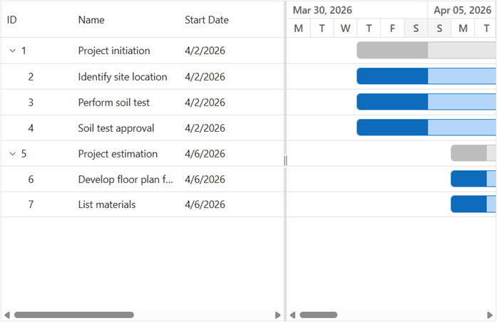

# Getting started with the ASP.NET Core Gantt control

This section explains how to include the [ASP.NET Core Gantt](https://www.syncfusion.com/gantt-sdk/aspnet-core-gantt-chart) control in your ASP.NET Core Web App using [Visual Studio](https://visualstudio.microsoft.com/vs/) and [Visual Studio Code](https://code.visualstudio.com/). You’ll learn how to configure the control, bind task data, map fields, and quickly visualize project timelines in just a few steps.

> **Ready to streamline your ASP.NET Core development?** Discover the full potential of ASP.NET Core controls with AI Coding Assistant. Effortlessly integrate, configure, and enhance your projects with intelligent, context-aware code suggestions, streamlined setups, and real-time insights—all seamlessly integrated into your preferred AI-powered IDEs like Visual Studio, Visual Studio Code, Cursor, CodeStudio and more. [Explore AI Coding Assistant](https://ej2.syncfusion.com/aspnetcore/documentation/ai-coding-assistant/overview)

To get started quickly with the ASP.NET Core Gantt control, you can check out this video:



## Create an ASP.NET Core web App with Razor pages





Create an **ASP.NET Core Web App** using Visual Studio via [Microsoft Templates](https://learn.microsoft.com/en-us/aspnet/core/tutorials/razor-pages/razor-pages-start?view=aspnetcore-10.0&tabs=visual-studio#create-a-razor-pages-web-app) or the [ASP.NET Core Extension](https://ej2.syncfusion.com/aspnetcore/documentation/visual-studio-integration/create-project).





Run the following command to create a new ASP.NET Core Web App.




dotnet new webapp -o GanttSample
code -r GanttSample




Alternatively, create an ASP.NET Core Web App using Visual Studio Code via [Microsoft Templates](https://learn.microsoft.com/en-us/aspnet/core/tutorials/razor-pages/razor-pages-start?view=aspnetcore-10.0&tabs=visual-studio-code#create-a-razor-pages-web-app) or the [ASP.NET Core Extension](https://ej2.syncfusion.com/aspnetcore/documentation/visual-studio-code-integration/create-project), or the [C# Dev Kit](https://marketplace.visualstudio.com/items?itemName=ms-dotnettools.csdevkit) extension.





## Install the required ASP.NET Core packages

Install the [Syncfusion.AspNetCore.Gantt](https://www.nuget.org/packages/Syncfusion.AspNetCore.Gantt) and [Syncfusion.AspNetCore.Themes](https://www.nuget.org/packages/Syncfusion.AspNetCore.Themes) NuGet packages. All Syncfusion ASP.NET Core packages are available on [nuget.org](https://www.nuget.org/packages?q=Syncfusion.EJ2). See the [NuGet packages](https://ej2.syncfusion.com/aspnetcore/documentation/nuget-packages) topic for details.





1. Go to *Tools → NuGet Package Manager → Manage NuGet Packages for Solution*.
2. Search the required NuGet packages (`Syncfusion.AspNetCore.Gantt` and `Syncfusion.AspNetCore.Themes`) and install them.

Alternatively, you can install the same packages using the Package Manager Console with the following commands.




Install-Package Syncfusion.AspNetCore.Gantt -Version {{ site.releaseversion }}
Install-Package Syncfusion.AspNetCore.Themes -Version {{ site.releaseversion }}








Open the terminal and run the following commands.




dotnet add package Syncfusion.AspNetCore.Gantt --version {{ site.releaseversion }}
dotnet add package Syncfusion.AspNetCore.Themes --version {{ site.releaseversion }}








## Add ASP.NET Core tag helpers

After the packages are installed, open the **~/Pages/_ViewImports.cshtml** file and import the `Syncfusion.AspNetCore.Gantt` and `Syncfusion.AspNetCore.Base` tag helpers.




@addTagHelper *, Syncfusion.AspNetCore.Gantt
@addTagHelper *, Syncfusion.AspNetCore.Base




## Add stylesheet and script resources

The theme stylesheet and script can be referenced from NuGet through [Static Web Assets](https://ej2.syncfusion.com/aspnetcore/documentation/appearance/theme#static-web-assets). Include the [stylesheet](https://ej2.syncfusion.com/aspnetcore/documentation/appearance/theme) and [script references](https://ej2.syncfusion.com/aspnetcore/documentation/common/adding-script-references) inside the `<head>` of **~/Pages/Shared/_Layout.cshtml** file.




<head>
    ...
    <link rel="stylesheet" href="_content/Syncfusion.AspNetCore.Themes/styles/fluent2.css" />
    
</head>




## Register the script manager

Open the **~/Pages/Shared/_Layout.cshtml** file and register the script manager (`<ejs-scripts>`) at the end of the `<body>` element as shown below.




<body>
    ...
    <!-- Syncfusion ASP.NET Core Script Manager -->
    <ejs-scripts></ejs-scripts>
</body>




## Create a sample data

Create a simple task hierarchy by assigning a `ParentID` to child tasks. To render tasks correctly in the Gantt control, each task must include a `StartDate` and either a `Duration` or an `EndDate`.




List<GanttDataSource> Tasks = new List<GanttDataSource>()
{
    new GanttDataSource() { TaskId = 1, TaskName = "Project initiation", StartDate = new DateTime(2019, 04, 02), EndDate = new DateTime(2019, 04, 21) },
    new GanttDataSource() { TaskId = 2, TaskName = "Identify site location", StartDate = new DateTime(2019, 04, 02), Duration = 4, Progress = 50, ParentID = 1 },
    new GanttDataSource() { TaskId = 3, TaskName = "Perform soil test", StartDate = new DateTime(2019, 04, 02), Duration = 4, Progress = 50, ParentID = 1 },
    new GanttDataSource() { TaskId = 4, TaskName = "Soil test approval", StartDate = new DateTime(2019, 04, 02), Duration = 4, Progress = 50, ParentID = 1 },
    new GanttDataSource() { TaskId = 5, TaskName = "Project estimation", StartDate = new DateTime(2019, 04, 02), EndDate = new DateTime(2019, 04, 21) },
    new GanttDataSource() { TaskId = 6, TaskName = "Develop floor plan for estimation", StartDate = new DateTime(2019, 04, 04), Duration = 3, Progress = 50, ParentID = 5 },
    new GanttDataSource() { TaskId = 7, TaskName = "List materials", StartDate = new DateTime(2019, 04, 04), Duration = 3, Progress = 50, ParentID = 5 }
};

public class GanttDataSource
{
    public int TaskId { get; set; }
    public string TaskName { get; set; }
    public DateTime StartDate { get; set; }
    public DateTime EndDate { get; set; }
    public int? Duration { get; set; }
    public int Progress { get; set; }
    public int? ParentID { get; set; }
}




## Configure task fields

Use the `taskFields` configuration to map the fields in your data source to the corresponding Gantt task properties.




<e-gantt-taskfields id="TaskId" name="TaskName" startDate="StartDate" endDate="EndDate" duration="Duration" progress="Progress" parentID="ParentID">
</e-gantt-taskfields>




### Field mapping reference

| Property | Description | Required |
|----------|-------------|----------|
| `id` | Unique task identifier | Yes |
| `name` | Task display name | Yes |
| `startDate` | Task start date | Yes |
| `endDate` | Task end date | No |
| `duration` | Task duration in days | Yes |
| `progress` | Task completion percentage (0-100) | No |
| `parentID` | Parent task ID for hierarchy | No |

## Add the ASP.NET Core Gantt control

Add the [ASP.NET Core Gantt](https://www.syncfusion.com/gantt-sdk/aspnet-core-gantt-chart) control in the **~/Pages/Index.cshtml** file and bind your task collection to it using the [dataSource](https://help.syncfusion.com/cr/aspnetcore-js2/Syncfusion.EJ2.Gantt.Gantt.html#Syncfusion_EJ2_Gantt_Gantt_DataSource) property.










## Run the application





Press <kbd>Ctrl</kbd>+<kbd>F5</kbd> (Windows) or <kbd>⌘</kbd>+<kbd>F5</kbd> (macOS) to launch the application. The [ASP.NET Core Gantt](https://www.syncfusion.com/gantt-sdk/aspnet-core-gantt-chart) control will render in your default web browser.





Open the terminal and run the following command.




dotnet run








> [View Sample in GitHub](https://github.com/SyncfusionExamples/ASP-NET-Core-Getting-Started-Examples/tree/main/Gantt/ASP.NET%20Core%20Tag%20Helper%20Examples).

## See also

- **[Key Elements](https://ej2.syncfusion.com/aspnetcore/documentation/gantt/key-elements)** - Learn about UI components and interactions
- **[Overview](https://ej2.syncfusion.com/aspnetcore/documentation/gantt/overview)** - Explore all available features

