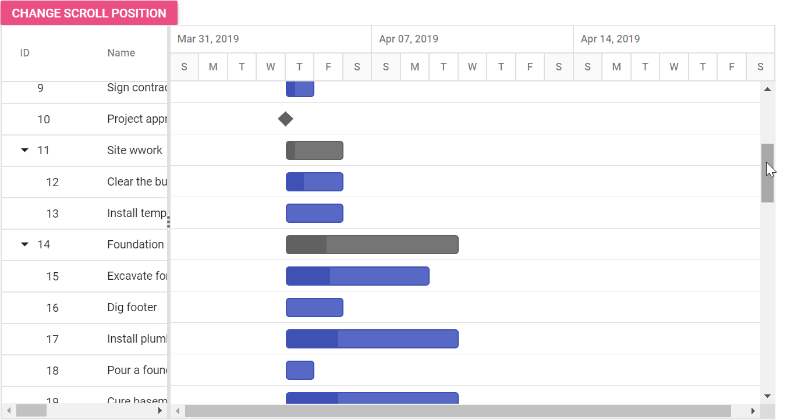

# Set the vertical scroll position

In the Gantt control, you can set the vertical scroller position dynamically by clicking the custom button using the `setScrollTop` method.
























