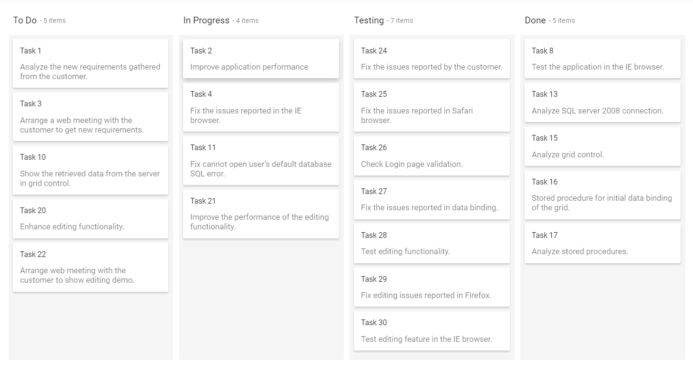
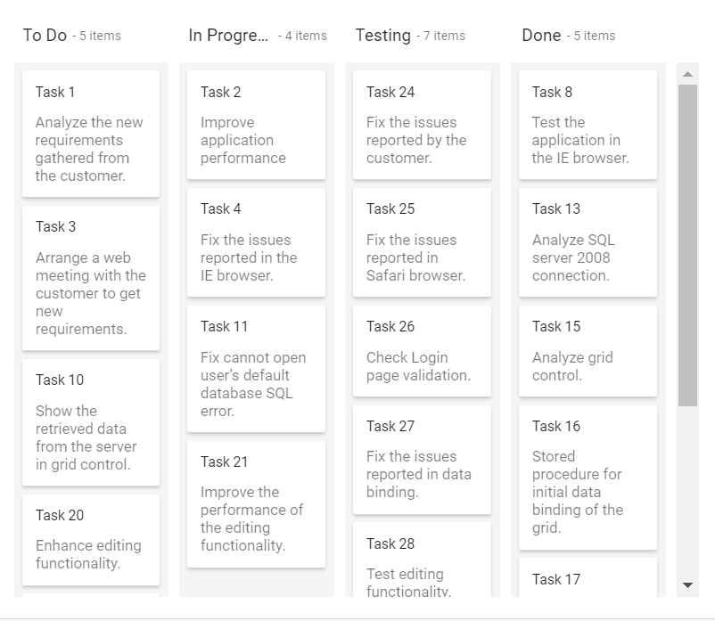

# Kanban dimensions

The Kanban dimensions refers to both height and width of the entire layout and it accepts three types of values.

* Auto
* Pixel
* Percentage

## Auto height and width

When height and width of the Kanban are set to `auto`, it will try as hard as possible to keep an element the same width as its parent container. In other words, the parent container that holds Kanban, its width or height will be the sum of its children. By default, Kanban is assigned with `auto` values for both the height and width properties.
























Output be like the below.

## Height and width in pixel

The Kanban height and width will be rendered exactly as per the given pixel values. It accepts both string and number values.
























Output be like the below.

## Height and width in percentage

When height and width of the Kanban are given in percentage, it will make the Kanban as wide as the parent container.
























Output be like the below.

