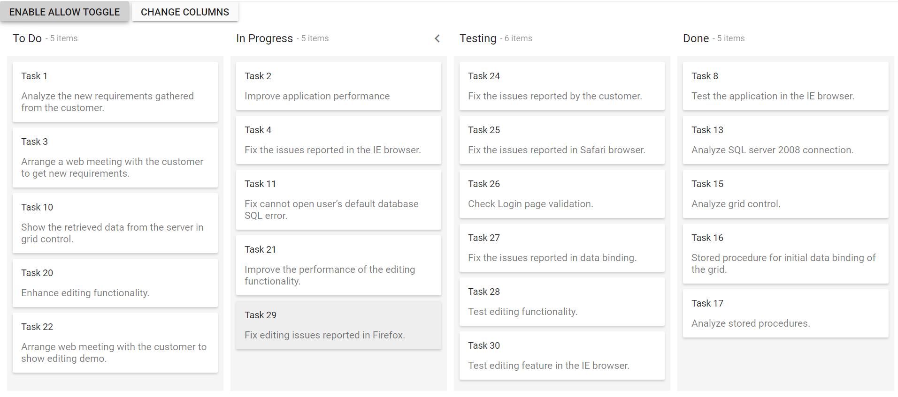

# Change Kanban columns dynamically

You can dynamically change the Kanban columns by using the [`columns`](../../api/kanban#columns) property.

 In the below sample, you can dynamically change the [`allowToggle`](../../api/kanban/columnsModel/#allowtoggle) property at the particular column when you click on the button. You can also change the initially created columns to the new Kanban columns by using the [`columns`](../../api/kanban#columns) property when you click on the button.
























Output be like the below.

