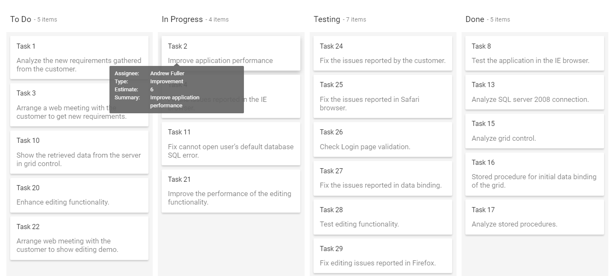

# Tooltip

The tooltip is used to show the card information when the cursor hover over the card elements using the `enableTooltip` property. Tooltip content is dynamically set based on hovering over the card elements.

N> If you wish to show tooltip on Kanban board custom elements, you need to add `e-tooltip-text` class name of a particular element.

## Tooltip template

You can customize the tooltip content with any HTML or CSS element and styling using the `tooltipTemplate` property. In the following demo, the tooltip is customized with HTML elements.
























Output be like the below.

