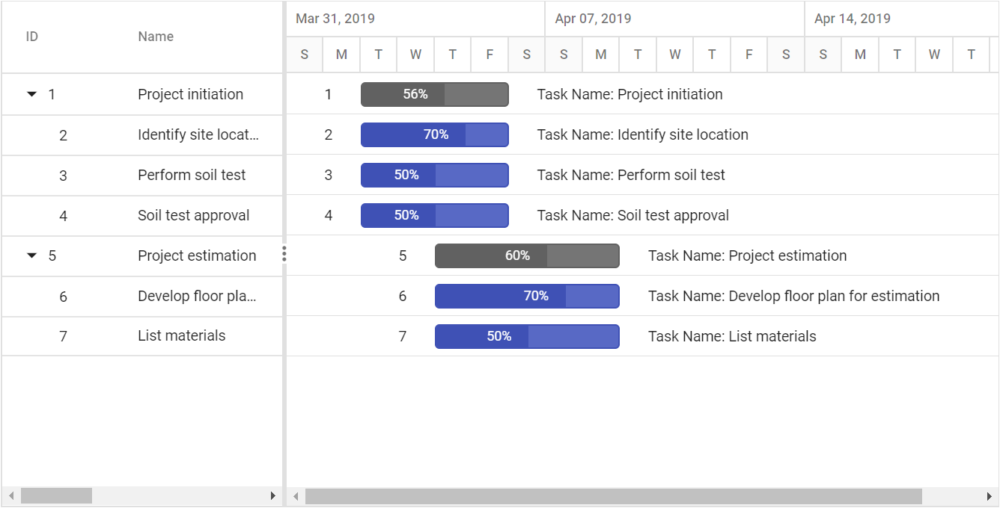

# Labels in ASP.NET MVC Gantt component

The Gantt control maps any data source fields to task labels using the [`LabelSettings.LeftLabel`](https://help.syncfusion.com/cr/aspnetcore-js2/Syncfusion.EJ2.Gantt.GanttLabelSettings.html#Syncfusion_EJ2_Gantt_GanttLabelSettings_LeftLabel), [`LabelSettings.RightLabel`](https://help.syncfusion.com/cr/aspnetcore-js2/Syncfusion.EJ2.Gantt.GanttLabelSettings.html#Syncfusion_EJ2_Gantt_GanttLabelSettings_RightLabel), and [`LabelSettings.TaskLabel`](https://help.syncfusion.com/cr/aspnetcore-js2/Syncfusion.EJ2.Gantt.GanttLabelSettings.html#Syncfusion_EJ2_Gantt_GanttLabelSettings_TaskLabel) properties. You can customize the task labels with templates.
























