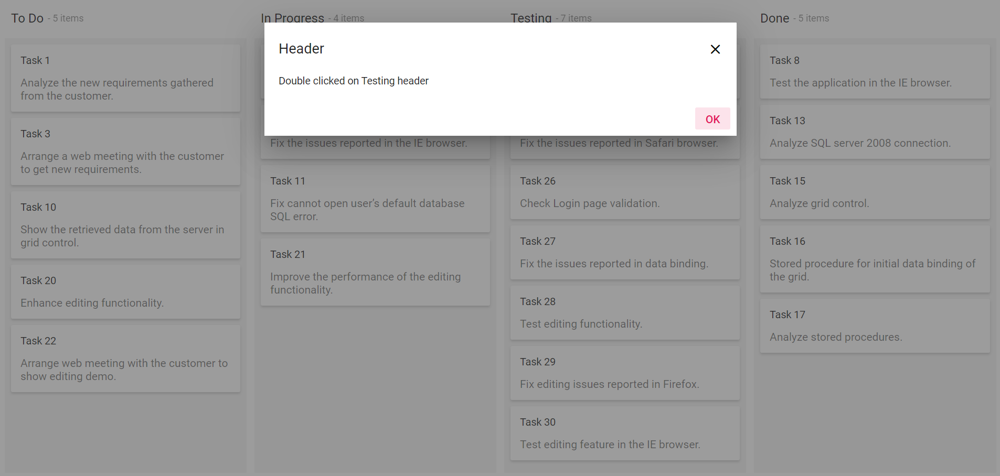

# Add header double click

You can bind the header double click event by using the [`dataBound`](../../api/kanban#dataBound) event at the initial rendering. You can get the column header text when you double click on the headers.
























Output be like the below.

