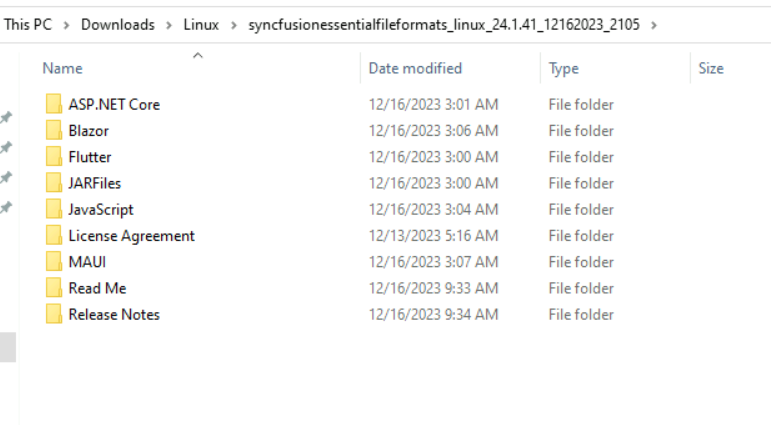

# Installing Syncfusion Gantt SDK Linux installer

## Step-by-Step Installation

N> Before proceeding, ensure that the [.NET SDK](https://dotnet.microsoft.com/download) is installed on your Linux machine and that you have extracted the Syncfusion Gantt SDK Linux installer (.zip) file downloaded from the Syncfusion website.

The steps below show how to install the Gantt SDK Linux installer.

1. Extract the Syncfusion Gantt SDK Linux installer (.zip) file. The files will be extracted to your machine.

   

2. The Linux zip file contains the following folders.

   

   N> An unlock key is not required to install the Linux installer.

3. You can launch the demo source and use the NuGet packages included in the Linux installer.

4. Run the following command on your Linux machine to restore the NuGet packages for the ASP.NET Core samples.

   **dotnet restore projectname -s \nuget**

## License Key Registration in Samples

After the installation, a license key is required to register the demo source included in the Linux installer. To learn the steps for license registration in the ASP.NET Core - EJ2 samples shipped with the Essential Studio Gantt SDK Linux installer, refer to the following:

* Register the license key in the [Program.cs](https://help.syncfusion.com/aspnet-core/licensing/how-to-register-in-an-application#for-aspnet-core-application-using-net-60) file if you created the ASP.NET Core web application with Visual Studio 2022 and .NET 6.0.
* Register the license key in the `Configure` method of [Startup.cs](https://help.syncfusion.com/aspnet-core/licensing/how-to-register-in-an-application#for-aspnet-core-application-using-net-50-or-net-31) file if you created the ASP.NET Core web application with .NET 5.0 or .NET 3.1.
