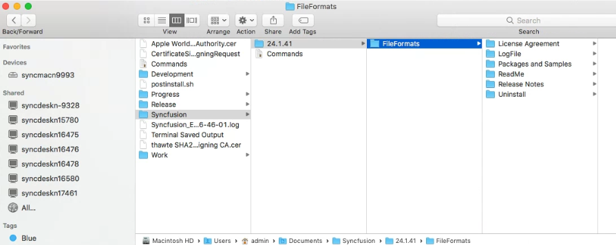

# Installing Syncfusion Gantt SDK Mac installer

## Resolving the Warning Message on Catalina macOS or Later

   When running the Essential Studio Gantt SDK Mac installer on Catalina macOS or later, the alert shown below is displayed.

   

   If you receive this alert, follow the steps below for the easiest solution.

   1.	Right-click the downloaded `.pkg` file.
   2.	Select the **Open With** option and choose **Installer (Default)**. The following pop-up appears.

		

   3.	When you click **Open**, the installer window opens.

## Step-by-Step Installation

N> Before proceeding, ensure that you have administrator privileges on the Mac machine and that you have downloaded the Syncfusion Essential Studio Gantt SDK Mac installer (.pkg) file from the Syncfusion website.

The steps below show how to install the Essential Studio Gantt SDK Mac installer.

1. Open the Syncfusion Essential Studio Gantt SDK Mac installer (.pkg) file. The installer wizard opens. Click **Continue**.

   

2. The Software License Agreement wizard appears. Click the **Continue** button.

   

3. The License Agreement confirmation window appears. If you have read the Software License Agreement, click **Agree**.

   

   N> An unlock key is not required to install the Essential Studio Gantt SDK Mac installer.

4. The Destination Select wizard appears. Here you can choose the disk on which to install the Syncfusion Essential Studio Gantt SDK Mac installer.

   

5. The Installation Type wizard appears. Click **Install** to begin the standard installation of the Syncfusion Essential Studio Gantt SDK Mac installer.

   

6. The Authentication window appears. To begin the installation, enter the Mac machine's password and click **Install Software**.

   

7. The installation process begins on your machine.

   

8. Once the installation is complete, the completion screen is displayed. To exit the installation wizard, click **Close**.

   

   By default, the Mac installer installs the files at the following location:

   **Location:** ~/Documents/Syncfusion/{version}/Gantt SDK

   

## License Key Registration in Samples

After the installation, a license key is required to register the demo source included in the Mac installer. To learn the steps for license registration in the ASP.NET Core - EJ2 samples shipped with the Essential Studio Gantt SDK Mac installer, refer to the following:

* Register the license key in the [Program.cs](https://ej2.syncfusion.com/aspnetcore/documentation/licensing/how-to-register-in-an-application#for-aspnet-core-application-using-net-60) file if you created the ASP.NET Core web application with Visual Studio 2022 and .NET 6.0.
* Register the license key in Configure method of [Startup.cs](https://ej2.syncfusion.com/aspnetcore/documentation/licensing/how-to-register-in-an-application#for-aspnet-core-application-using-net-50-or-net-31)