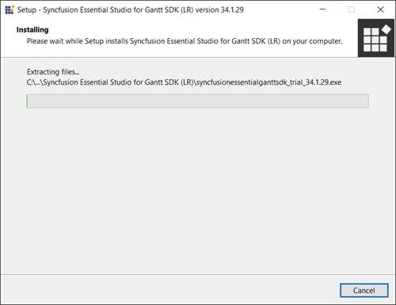
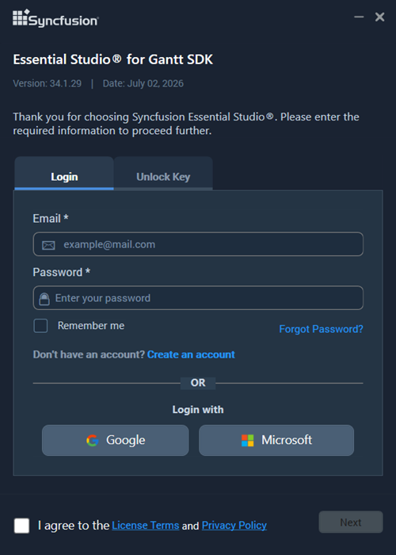
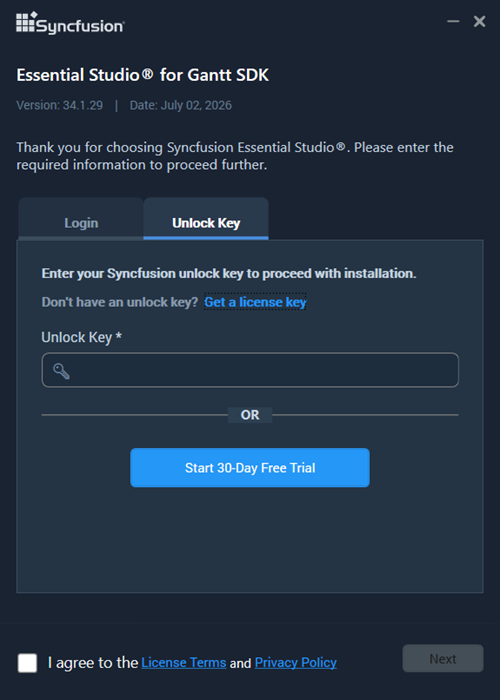
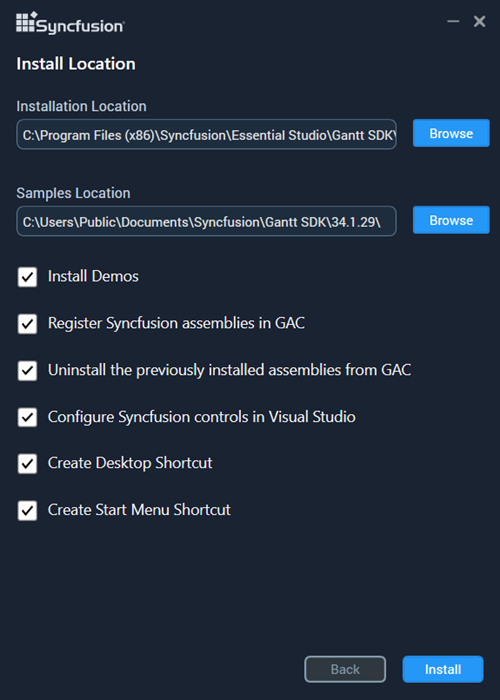
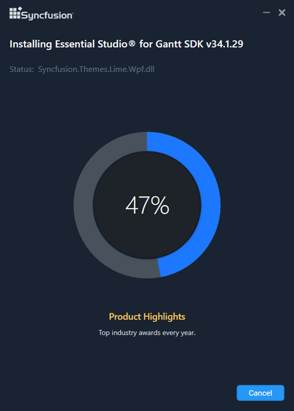
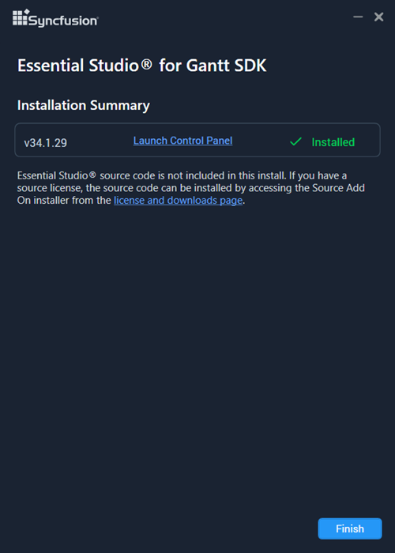

# Installing Syncfusion Gantt SDK offline installer

## Installing with UI

N> Before proceeding, ensure that you have administrator privileges on the Windows machine, the Syncfusion Gantt SDK offline installer (.exe) file is downloaded from the Syncfusion website, and that you have a valid Syncfusion account or unlock key.

The steps below show how to install the Essential Studio Gantt SDK installer.

1.	Open the Syncfusion Gantt SDK offline installer file from the downloaded location by double-clicking it. The Installer Wizard automatically opens and extracts the package.

    

    N> The Installer wizard extracts the `syncfusionessentialganttsdk_(version).exe` dialog, which displays the package's unzip operation.

2.	To unlock the Syncfusion offline installer, you have two options:

    * *Login To Install*

    * *Use Unlock Key*

    **Login To Install**

    You must enter your Syncfusion email address and password. If you don't already have a Syncfusion account, you can sign up for one by clicking **"Create an account"**. If you have forgotten your password, click on **"Forgot Password"** to create a new one. Once you've entered your Syncfusion email and password, click **Next**.

    

    **Use Unlock Key**

    Unlock keys are used to unlock the Syncfusion offline installer, and they are platform and version specific. You should use either a Syncfusion licensed or trial unlock key to unlock the Syncfusion Gantt SDK installer.

    The trial unlock key is only valid for 30 days, and the installer will not accept an expired trial key.

    To learn how to generate an unlock key for both trial and licensed products, see [this](https://www.syncfusion.com/kb/8069/how-to-generate-unlock-key-for-essentials-studio-products) Knowledge Base article.

    

3.	After reading the License Terms and Privacy Policy, check the **"I agree to the License Terms and Privacy Policy"** check box. Click the **Next** button.

4.	Change the install and sample locations here. You can also change the Additional settings. Click **Next** to install with the default settings, or **Install** to install with the customized settings.

    

    **Additional Settings**

    * Select the **Install Demos** check box to install Syncfusion samples, or leave the check box unchecked if you do not want to install Syncfusion samples.
    * Select the **Register Syncfusion Assemblies in GAC** check box to install the latest Syncfusion assemblies in GAC, or clear this check box when you do not want to install the latest assemblies in GAC.
    * Select the **Configure Syncfusion controls in Visual Studio** check box to configure the Syncfusion controls in the Visual Studio toolbox, or clear this check box when you do not want to configure the Syncfusion controls in the Visual Studio toolbox during installation. Note that you must also select the **Register Syncfusion assemblies in GAC** check box when you select this check box.
    * Select the **Configure Syncfusion Extensions controls in Visual Studio** check box to configure the Syncfusion Extensions in Visual Studio, or clear this check box when you do not want to configure the Syncfusion Extensions in Visual Studio.
    * Check the **Create Desktop Shortcut** check box to add a desktop shortcut for the Syncfusion Control Panel.
    * Check the **Create Start Menu Shortcut** check box to add a shortcut to the Start menu for the Syncfusion Control Panel.

5.	If any previous versions of the current product are installed, the **Uninstall Previous Version(s)** wizard opens. Select the **Uninstall** check box to uninstall the previous versions and then click the **Proceed** button.

    

    N> From the 2021 Volume 1 release, Syncfusion has added the option to uninstall previous versions from 18.1 while installing the new version.

    N> If any version is selected to uninstall, a confirmation screen appears; if continue is selected, the Progress screen displays the uninstall and install progress, respectively. If none of the versions are chosen to be uninstalled, only the installation progress is displayed.

    **Confirmation Alert**

    

    **Uninstall Progress:**

    

    **Install Progress**

    

    N> The Completed screen is displayed once the Gantt SDK product is installed. If any version is selected to uninstall, the completed screen displays both install and uninstall status.

    

6.  After installing, click the **Launch Control Panel** link to open the Syncfusion Control Panel.

7.  Click the **Finish** button. Your system has been installed with the Syncfusion Essential Studio Gantt SDK product.

## Installing in Silent Mode

The Syncfusion Essential Studio Gantt SDK Installer supports installation and uninstallation via the command line.

### Command Line Installation

To install through the Command Line in Silent mode, follow the steps below.

1.	Run the Syncfusion Gantt SDK installer by double-clicking it. The Installer Wizard automatically opens and extracts the package.
2.	The file `syncfusionessentialganttsdk_(version).exe` will be extracted into the Temp directory.
3.	Run `%temp%`. The Temp folder opens. The `syncfusionessentialganttsdk_(version).exe` file is located in one of the folders.
4.	Copy the extracted `syncfusionessentialganttsdk_(version).exe` file to a local drive.
5.	Exit the Wizard.
6.	Run Command Prompt in administrator mode and enter the following arguments.

   
    **Arguments:** “installer file path\SyncfusionEssentialStudio(platform)_(version).exe” /Install silent /UNLOCKKEY:“(product unlock key)” [/log “{Log file path}”] [/InstallPath:{Location to install}] [/InstallSamples:{true/false}] [/InstallAssemblies:{true/false}] [/UninstallExistAssemblies:{true/false}] [/InstallToolbox:{true/false}]

    N> [..] – Arguments inside the square brackets are optional.

    **Example:** `"D:\Temp\syncfusionessentialganttsdk_x.x.x.x.exe" /Install silent /UNLOCKKEY:"product unlock key" /log "C:\Temp\EssentialStudio_Platform.log" /InstallPath:C:\Syncfusion\x.x.x.x /InstallSamples:true /InstallAssemblies:true /UninstallExistAssemblies:true /InstallToolbox:true`

7.  Essential Studio for Gantt SDK is installed.

    N> `x.x.x.x` should be replaced with the Essential Studio version and the **Product Unlock Key** needs to be replaced with the Unlock Key for that version.

### Command Line Uninstallation

Syncfusion Essential Gantt SDK can be uninstalled silently using the Command Line.

1.	Run the Syncfusion Gantt SDK installer by double-clicking it. The Installer Wizard automatically opens and extracts the package.
2.	The file `syncfusionessentialganttsdk_(version).exe` will be extracted into the Temp directory.
3.	Run `%temp%`. The Temp folder opens. The `syncfusionessentialganttsdk_(version).exe` file is located in one of the folders.
4.	Copy the extracted `syncfusionessentialganttsdk_(version).exe` file to a local drive.
5.	Exit the Wizard.
6.	Run Command Prompt in administrator mode and enter the following arguments.

    **Arguments:** `"Copied installer file path\syncfusionessentialganttsdk_(version).exe" /uninstall silent`

    **Example:** `"D:\Temp\syncfusionessentialganttsdk_x.x.x.x.exe" /uninstall silent`

7.  Essential Studio for Gantt SDK is uninstalled.
   
   
