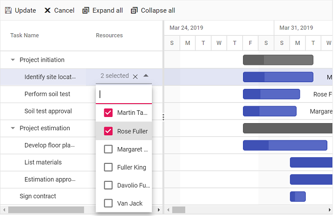

# Resources in JavaScript Gantt Chart Control

Resources in the JavaScript Gantt Chart control represent people, equipment, or materials allocated to tasks, visualized in taskbars and labels for clear utilization tracking. Assigned via the [resources](https://ej2.syncfusion.com/javascript/documentation/api/gantt#resources) property, resources map to tasks using [resourceFields](https://ej2.syncfusion.com/javascript/documentation/api/gantt#resourcefields) for ID, name, unit, and group. This enables display of resource names in columns or labels with [labelSettings](https://ej2.syncfusion.com/javascript/documentation/api/gantt/labelSettings), highlighting workloads and overallocation. The [queryTaskbarInfo](https://help.syncfusion.com/gantt-sdk/javascript/gantt-chart/events#querytaskbarinfo) event customizes taskbar styles based on resources, such as color-coding. Resources include ARIA labels for accessibility, ensuring screen reader compatibility, and adapt to responsive designs, though narrow screens may truncate names for multiple assignments. By default, resources allocate 100% unit if unspecified.

## Configure resource collection

The resource collection defines available resources as JSON objects with ID, name, unit, and group, mapped via [resourceFields](https://ej2.syncfusion.com/javascript/documentation/api/gantt#resourcefields):

- **id**: Maps to a unique identifier for task assignment.
- **name**: Maps to the resource name displayed in labels or columns.
- **unit**: Maps to the work capacity percentage (0-100%) per day.
- **group**: Maps to categories for grouping resources.

The following code demonstrates resource collection setup:

```js
var projectResources = [
  {
    resourceId: 1,
    resourceName: "Martin Tamer",
    resourceGroup: "Planning Team",
    resourceUnit: 50,
  },
  {
    resourceId: 2,
    resourceName: "Rose Fuller",
    resourceGroup: "Testing Team",
    resourceUnit: 70,
  },
  {
    resourceId: 3,
    resourceName: "Margaret Buchanan",
    resourceGroup: "Approval Team",
  },
  {
    resourceId: 4,
    resourceName: "Fuller King",
    resourceGroup: "Development Team",
  },
  {
    resourceId: 5,
    resourceName: "Davolio Fuller",
    resourceGroup: "Approval Team",
  },
  {
    resourceId: 6,
    resourceName: "Van Jack",
    resourceGroup: "Development Team",
    resourceUnit: 40,
  },
];

var resourceFields = {
  id: "resourceId",
  name: "resourceName",
  unit: "resourceUnit",
  group: "resourceGroup",
};
```

This configuration maps resources for assignment and display.

## Assign resources to tasks

Resources are assigned to tasks using resource IDs in the data source, mapped via [taskFields.resourceInfo](https://ej2.syncfusion.com/javascript/documentation/api/gantt/taskFields#resourceinfo). Assignments can be added or edited dynamically via cell or dialog editing, triggered by double-clicking.

**Single resource assignment:**

Assign a single resource without unit for default 100% allocation.

```typescript
{
    TaskID: 2,
    TaskName: 'Identify site location',
    StartDate: new Date('04/02/2019'),
    Duration: 0,
    Progress: 50,
    resources: [1]
}
```

**Multiple resources with custom units:**

Assign multiple resources with specific units.

```typescript
{
    TaskID: 2,
    TaskName: 'Identify site location',
    StartDate: new Date('03/29/2019'),
    Duration: 2,
    Progress: 30,
    resources: [{ resourceId: 1, unit: 70 }, 6]
}
```

Units from the resource collection apply unless overridden at the task level.

The following example shows resource assignment:












## Manage resource assignments

Add or remove resources via cell or dialog editing. Cell editing modifies assignments by double-clicking the resource cell, while dialog editing uses the resource tab in the edit dialog.


_Alt text: Resource cell editing in the Gantt grid for assignment modifications._


_Alt text: Resource dialog editing tab for multiple allocations and units._

## Customize resource styling

Customize resource display using column templates for the resource column and the [queryTaskbarInfo](https://help.syncfusion.com/gantt-sdk/javascript/gantt-chart/events#querytaskbarinfo) event for taskbar styling based on assigned resources.

The following example demonstrates custom resource styling:












This configuration applies background colors to resource columns and taskbars, with the `queryTaskbarInfo` event modifying taskbar properties dynamically.

## See also

- [How to configure resource view?](./resource-view)
- [How to manage task dependencies?](./task-dependency)
- [How to customize taskbars?](./taskbar)
