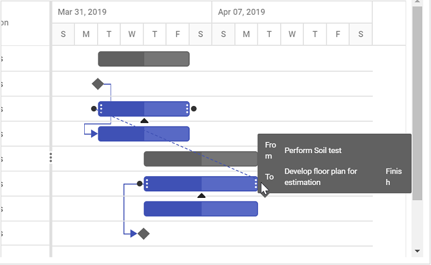
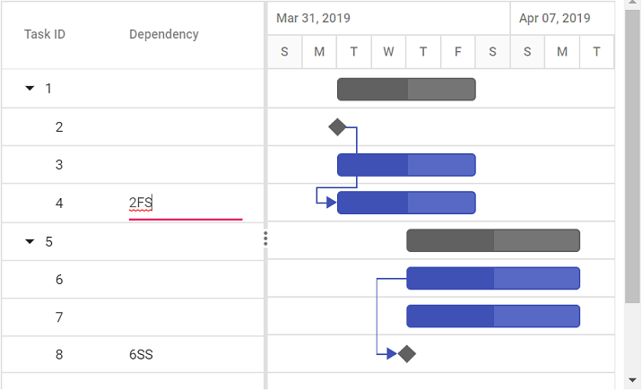
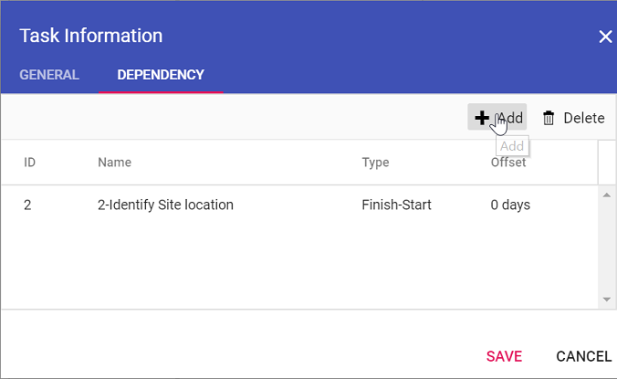
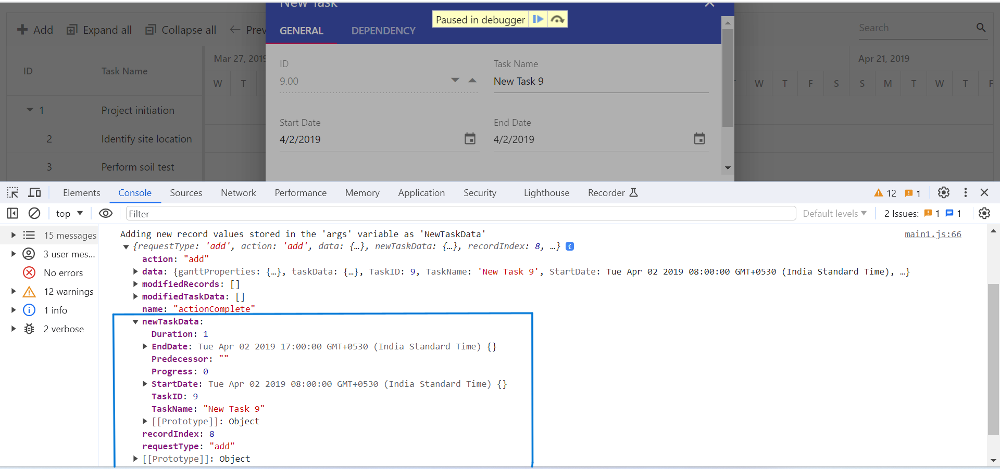
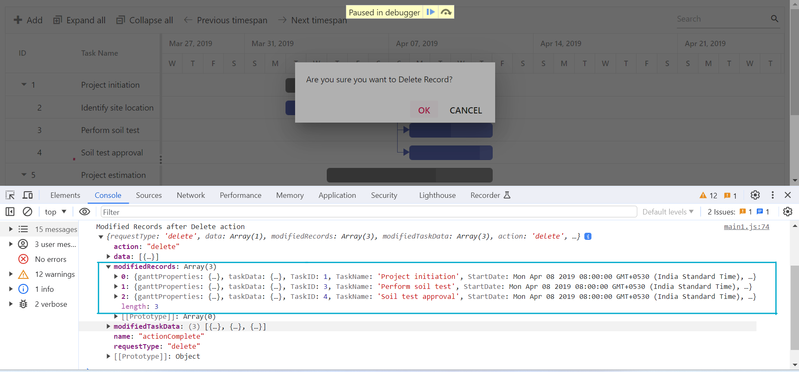

# Editing tasks in TypeScript Gantt control

The editing feature can be enabled in the Gantt control by enabling the [editSettings.allowEditing](https://ej2.syncfusion.com/documentation/api/gantt/editSettings#allowediting) and [editSettings.allowTaskbarEditing](https://ej2.syncfusion.com/documentation/api/gantt/editSettings#allowtaskbarediting) properties.

The following editing options are available to update the tasks in the Gantt chart:

- Cell
- Dialog
- Taskbar
- Dependency links

## Cell editing

By setting the edit mode to auto using the [editSettings.mode](https://ej2.syncfusion.com/documentation/api/gantt/editSettings#mode) property, the tasks can be edited through TreeGrid cells by double-clicking.

`Note:` If the [Edit](https://ej2.syncfusion.com/documentation/api/gantt#editmodule) module is not injected, you cannot edit the tasks through TreeGrid cells.

The following code example shows you how to enable the cell editing in Gantt control.












`Note:` When the edit mode is set to `Auto`, on performing double-click action on TreeGrid side, the cells will be changed to editable mode and on performing double-click action on chart side, the edit dialog will appear for editing the task details.

## Dialog editing

Modify the task details through the edit dialog by setting the edit [mode](https://ej2.syncfusion.com/documentation/api/gantt/editSettings#mode) to `Dialog`.












`Note:` In dialog editing mode, the edit dialog appears when performing double-click action on both TreeGrid or Gantt chart sides.

### Sections or tabs in dialog

In the Gantt dialog, you can define the required tabs or editing sections using the [addDialogFields](https://ej2.syncfusion.com/documentation/api/gantt#adddialogfields) and [editDialogFields](https://ej2.syncfusion.com/documentation/api/gantt#editdialogfields) properties. Every tab is defined using the [type](https://ej2.syncfusion.com/documentation/api/gantt/dialogFieldType) property.












### Limiting data fields in general tab

In the Gantt dialog, you can make only specific data source fields visible for editing by using the [addDialogFields](https://ej2.syncfusion.com/documentation/api/gantt#adddialogfields) and [editDialogFields](https://ej2.syncfusion.com/documentation/api/gantt#editdialogfields) properties. The data fields are defined with [type](https://ej2.syncfusion.com/documentation/api/gantt/addDialogFieldSettings#type) and [fields](https://ej2.syncfusion.com/documentation/api/gantt/addDialogFieldSettings#fields) properties.

`Note:` You can also define the custom fields in the add/edit dialog General tab using the [fields](https://ej2.syncfusion.com/documentation/api/gantt/addDialogFieldSettings#fields) property.












## Task dependencies

In the Gantt control, you can update the dependencies between the tasks and link the tasks interactively. The task dependencies can be mapped from the data source using the [dependency](https://ej2.syncfusion.com/documentation/api/gantt/taskFields#dependency) property.

You can update the task dependencies using the following ways:

- Mouse interactions: Using connector points in the taskbar, you can perform drag and drop action to create task dependency links.
- Edit dialog: Create or remove the task dependencies using the `Dependency` tab in the edit dialog.
- Cell editing: Create or remove the task links using cell editing.

The following code example demonstrates how to enable task dependency editing in the Gantt chart using the [editSettings](https://ej2.syncfusion.com/documentation/api/gantt/editSettings) property.












Updating with mouse interaction action

Updating with cell edit

Updating with dialog

`Note:` When the edit mode is set to `Auto`, on performing double-click action on TreeGrid side, the cells will be changed to editable mode and on performing double-click action on chart side, the edit dialog will appear for editing the task details.

## Update task values using method

Tasks' value can be dynamically updated by using the [updateRecordById](https://ej2.syncfusion.com/documentation/api/gantt#updaterecordbyid) method. You can call this method on any custom action. The following code example shows how to use this method to update a task.

> NOTE: Using the [updateRecordById](https://ej2.syncfusion.com/documentation/api/gantt#updaterecordbyid) method, you cannot update the task ID value.












