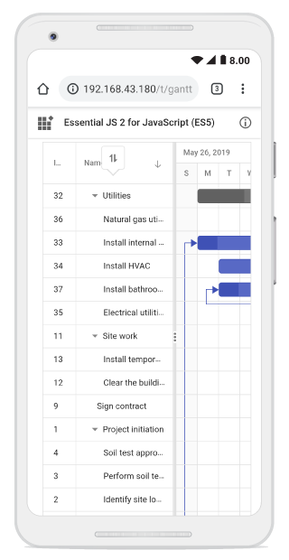

# Sorting in TypeScript Gantt Chart Control

The Syncfusion<sup style="font-size:70%">&reg;</sup> TypeScript Gantt Chart control provides sorting functionality to arrange task data in ascending or descending order based on column values.

To enable sorting, set the [allowSorting](https://ej2.syncfusion.com/documentation/api/gantt#allowsorting) property to **true**. You can configure sorting behavior using the [sortSettings](https://ej2.syncfusion.com/documentation/api/gantt/sortSettings) property.

Sorting is applied by clicking a column header. For multi-column sorting, hold the **CTRL** key while selecting additional headers. To remove sorting from a specific column in a multi-sorted view, hold the **SHIFT** key and click the column header. For details on keyboard interactions, refer to the [selection keyboard interaction](../grid/accessibility#keyboard-interaction) documentation.

To enable sorting functionality, inject the [Sort](https://ej2.syncfusion.com/documentation/api/gantt#sortmodule) module into the Gantt control.












> - The Gantt columns are sorted in the ascending order. If you click the already sorted column, the sort direction toggles.
> - To disable sorting for a particular column, set the [columns.allowSorting](https://ej2.syncfusion.com/documentation/api/gantt/column#allowsorting) property to **false**.

## Initial sorting

You can apply sorting during the initial render of the Syncfusion TypeScript Gantt Chart control by configuring the [sortSettings.columns](https://ej2.syncfusion.com/documentation/api/gantt/sortSettings#columns) property. Each column should be defined with a specific [field](https://ej2.syncfusion.com/documentation/api/gantt/sortDescriptorModel#field) and [direction](https://ej2.syncfusion.com/documentation/api/gantt/sortDescriptorModel#direction), ensuring that the Gantt loads with the desired sort order applied to the specified columns.

The following code example shows how to add sorted columns during Gantt initialization, with `field` set to **TaskID** and `direction` to **Descending**, and another with `field` as **TaskName** and `direction` as **Ascending**.












## Sort columns externally

You can externally sort columns, remove a specific sort, or clear all sorting in the Syncfusion<sup style="font-size:70%">&reg;</sup> TypeScript Gantt Chart control using button clicks.

### Add sort columns

You can externally sort a column in the Syncfusion<sup style="font-size:70%">&reg;</sup> TypeScript Gantt Chart control using the [sortColumn](https://ej2.syncfusion.com/documentation/api/gantt#sortcolumn) method with parameters for column name, sort direction, and multi-sort configuration.












### Remove sort columns

You can externally remove sorting from a specific column in the Syncfusion<sup style="font-size:70%">&reg;</sup> TypeScript Gantt Chart control using the [removeSortColumn](https://ej2.syncfusion.com/documentation/api/gantt/sort#removesortcolumn) method by passing the column name.












### Clear sorting

You can clear all sorted columns in the Syncfusion<sup style="font-size:70%">&reg;</sup> TypeScript Gantt Chart control using the [clearSorting](https://ej2.syncfusion.com/documentation/api/gantt#clearsorting) method to reset the Gantt Chart to its unsorted state.












## Customize sort icon

You can customize the sort icons in the Syncfusion<sup style="font-size:70%">&reg;</sup> TypeScript Gantt Chart control by overriding the **.e-icon-ascending** and **.e-icon-descending** CSS classes using the `content` property, as shown below:

```css
.e-gantt .e-icon-ascending::before {
  content: "\e7aa";
}

.e-gantt .e-icon-descending::before {
  content: "\e71f";
}
```












## Custom sorting

You can customize the default sort behavior for a column in the Syncfusion<sup style="font-size:70%">&reg;</sup> TypeScript Gantt Chart control by assigning a [column.sortComparer](https://ej2.syncfusion.com/documentation/api/gantt/column#sortcomparer) function to define custom sorting logic.

The sorting process includes the following steps:

1. Ascending → Descending → Clear Sorting (resets to original data source order).
2. Child records are sorted within their respective parent groups.
3. Null values in child records appear at the bottom of each parent group, not across the entire Gantt Chart dataset.












### Display null values always at bottom

You can customize the sorting behavior in the Syncfusion<sup style="font-size:70%">&reg;</sup> TypeScript Gantt Chart control to make `null` values consistently appear at the bottom, regardless of sort direction, by defining a column-level [column.sortComparer](https://ej2.syncfusion.com/documentation/api/gantt/column#sortcomparer) function. By default, `null` values are placed at the bottom when sorting in ascending order and at the top when sorting in descending order. Applying a custom `sortComparer` helps override this default logic and is particularly useful when working with datasets where `null` entries should be visually separated from valid data.

The example below demonstrates how to display `null` values at the bottom of the Gantt Chart while sorting the `TaskName` column in both ascending and descending order.












## Sorting custom columns

You can sort custom columns of various types such as string or numeric in the Syncfusion<sup style="font-size:70%">&reg;</sup> TypeScript Gantt Chart control by adding them to the column collection. Initial sorting can be configured using the [sortSettings](https://ej2.syncfusion.com/documentation/api/gantt/sortSettings) property, or sorting can be triggered dynamically through external actions such as a button click.

The following code snippet demonstrates how to sort the `CustomColumn` using an external button.












## Prevent sorting on specific columns

You can prevent sorting on specific columns in the Syncfusion<sup style="font-size:70%">&reg;</sup> TypeScript Gantt Chart control by handling the [actionBegin](https://ej2.syncfusion.com/documentation/gantt/events#actionbegin) or [actionComplete](https://ej2.syncfusion.com/documentation/gantt/events#actioncomplete) events. Alternatively, you can disable sorting for a column by setting its [allowSorting](https://ej2.syncfusion.com/documentation/api/gantt/column#allowsorting) property to **false** in the column configuration.

The following sample demonstrates how to prevent sorting for the **TaskID** and **StartDate** columns.












## Disable clear sort

By default, clicking a column header switches the sort order between ascending, descending, and unsorted. To restrict this to only ascending and descending, set [sortSettings.allowUnsort](https://ej2.syncfusion.com/documentation/api/gantt/sortsettings#allowunsort) to **false**. This ensures sorting remains active without reverting to an unsorted state.












## Touch interaction

To perform a tap action on a column header in the Syncfusion<sup style="font-size:70%">&reg;</sup> TypeScript Gantt Chart control, the [sorting](sorting#sorting) operation is triggered for the selected column. A popup appears when multi-column sorting is enabled. To sort multiple columns, tap the popup and then tap the desired column headers. The following screenshot shows Gantt touch sorting.


