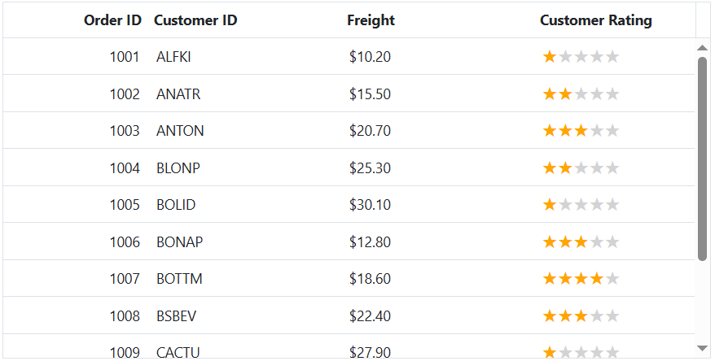

# Customize the Empty Record Template in ASP.NET Core Grid

The empty record template feature in the Syncfusion ASP.NET Core Grid allows you to use custom content such as images, text, or other components, when the Grid doesn't contain any records to display. This feature replaces the default message of 'No records to display' typically shown in the Grid.

To activate this feature, set the `emptyRecordTemplate` property of the Grid. The `emptyRecordTemplate` property expects the HTML element or a function that returns the HTML element.

In the following example, an image and text have been rendered as a template to indicate that the Grid has no data to display.










