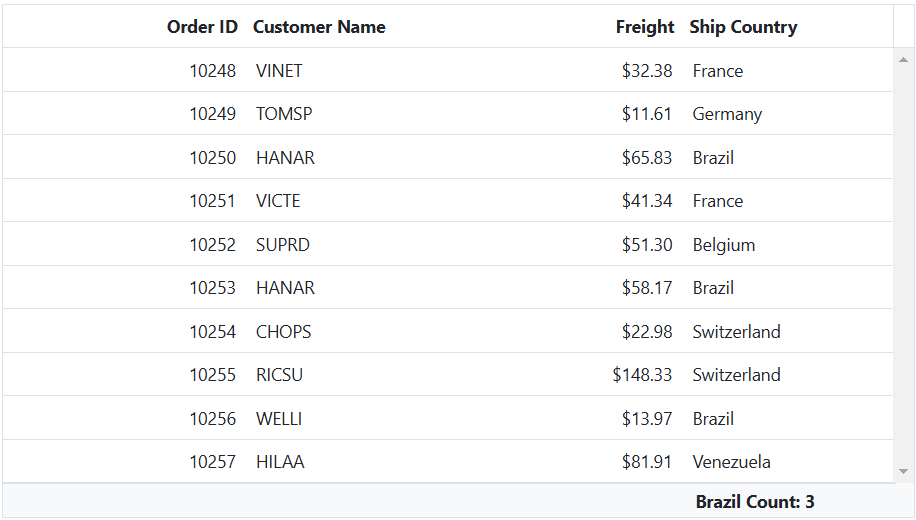
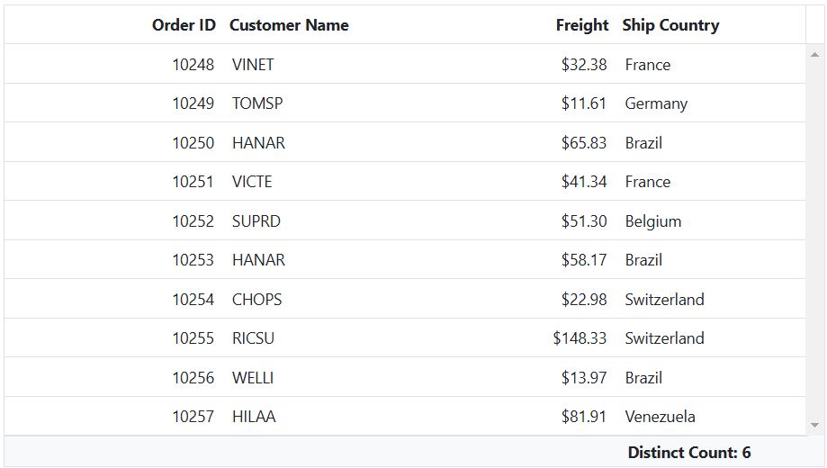

# Custom aggregate in ASP.Net MVC Grid component

The custom aggregate feature in Syncfusion's ASP.Net MVC Grid component allows you to calculate aggregate values using your own aggregate function. This feature can be useful in scenarios where the built-in aggregate functions do not meet your specific requirements. To use the custom aggregate option, follow the steps below:

* Set the `Type` property to **Custom** in the `AggregateColumn`.

* Provide your custom aggregate function in the `CustomAggregate` property.

The custom aggregate function will be invoked differently for total and group aggregations:

**Total Aggregation:** The custom aggregate function will be called with the whole dataset and the current aggregate column object as arguments.

**Group Aggregation:** The custom aggregate function will be called with the current group details and the aggregate column object as arguments.

Here's an example that demonstrates how to use the custom aggregate feature in the ASP.Net MVC Grid component:










> To access the custom aggregate value inside template, use the key as **Custom**

## Show the count of distinct values in aggregate row

You can calculate the count of distinct values in an aggregate row by using custom aggregate functions. By specifying the `Type` as **Custom** and providing a custom aggregate function in the `CustomAggregate` property, you can achieve this behavior.

Here's an example that demonstrates how to show the count of distinct values for the **ShipCountry** column using a custom aggregate.










> To display the aggregate value of the current column in another column, you can use the `ColumnName` property. If the `ColumnName` property is not defined, the field name value will be assigned to the `ColumnName` property. 