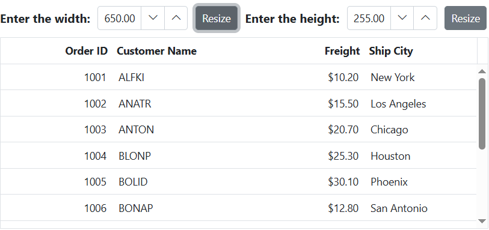

# Resize the Grid in various dimension in ASP.NET MVC Grid

The Syncfusion ASP.NET MVC Grid offers a friendly way to resize the Grid, allowing you to adjust its width and height for improved data visualization.

To resize the Grid externally, you can use an external button to modify the width of the parent element that contains the Grid. This will effectively resize the Grid along with its parent container.

The following example demonstrates how to resize the Grid on external button click based on input:










