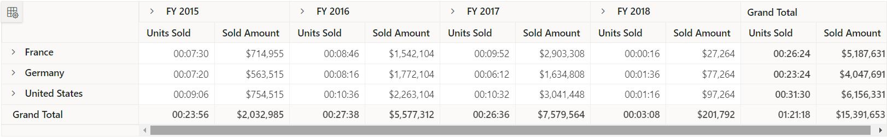

# Display string value to pivot table values

The Pivot Table allows users to display custom string values in value cells by using the [`AggregateCellInfo`](https://help.syncfusion.com/cr/aspnetmvc-js2/Syncfusion.EJ2.PivotView.PivotView.html#Syncfusion_EJ2_PivotView_PivotView_AggregateCellInfo) event. This is useful when you need to format numeric values into readable strings, such as converting seconds to time format or applying custom formatting rules.

## Converting numeric values to time format

The following example demonstrates how to convert numeric values in the **Sold** field to time format (HH:MM:SS) using the [`AggregateCellInfo`](https://help.syncfusion.com/cr/aspnetmvc-js2/Syncfusion.EJ2.PivotView.PivotView.html#Syncfusion_EJ2_PivotView_PivotView_AggregateCellInfo) event. The event provides access to cell data through `args.cellSets`, allowing you to customize the display value based on the underlying data.
























