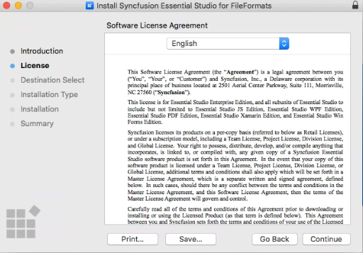

# Installing Syncfusion Grid SDK Mac Installer

## Resolving the macOS Gatekeeper Warning

When you run the Grid SDK Mac installer on macOS Catalina (10.15) or later, the following alert may be displayed.

If you receive this alert, follow these steps to launch the installer:

1. Open **Finder** and navigate to the downloaded PKG file (typically in the `~/Downloads` folder).
2. Right-click the downloaded PKG file and select **Open With → Installer (Default)**. The following dialog appears.

   

3. Click **Open** to launch the installer window.

## Step-by-Step Installation

The steps below describe how to install the Grid SDK Mac installer.

1. Open the Syncfusion Grid SDK Mac installer (.pkg) file. The installer wizard opens. Click **Continue**.

   

2. The Software License Agreement wizard will appear. Click the **Continue** button.

   

3. The License Agreement confirmation window will appear. After you have read the Software License Agreement, click **Agree**.

   

   N> An unlock key is not required to install the Grid SDK Mac installer.

4. The Destination Select wizard will appear. Select the disk on which to install the Grid SDK Mac installer, and then click **Continue**.

   

5. The Installation Type wizard will appear. Choose **Standard Install** (default) for the standard set of files, or click **Customize** to select or deselect optional components. Click **Install** to begin the installation.

   

6. The Authentication window will appear. To begin the installation, enter the Mac administrator password and click **Install Software**.

   

7. The installation process begins on your machine.

   

8. When the installation is complete, the summary screen is displayed. Click **Close** to exit the installation wizard.

   
   
   By default, Mac installer will install the files in following location.

   **Location:** {Documents}/Syncfusion/{version}/Grid SDK
   
   

## License key registration in samples

After the installation, the license key is required to register the demo source that is included in the Mac installer. To learn about the steps for license registration for the ASP.NET Core - EJ2 samples in the Essential Studio Grid SDK Mac installer, please refer to this.

* Register the license key in the [Program.cs](https://ej2.syncfusion.com/aspnetcore/documentation/licensing/how-to-register-in-an-application#for-aspnet-core-application-using-net-60) file if you created the ASP.NET Core web application with Visual Studio 2022 and .NET 6.0.
* Register the license key in Configure method of [Startup.cs](https://ej2.syncfusion.com/aspnetcore/documentation/licensing/how-to-register-in-an-application#for-aspnet-core-application-using-net-50-or-net-31)